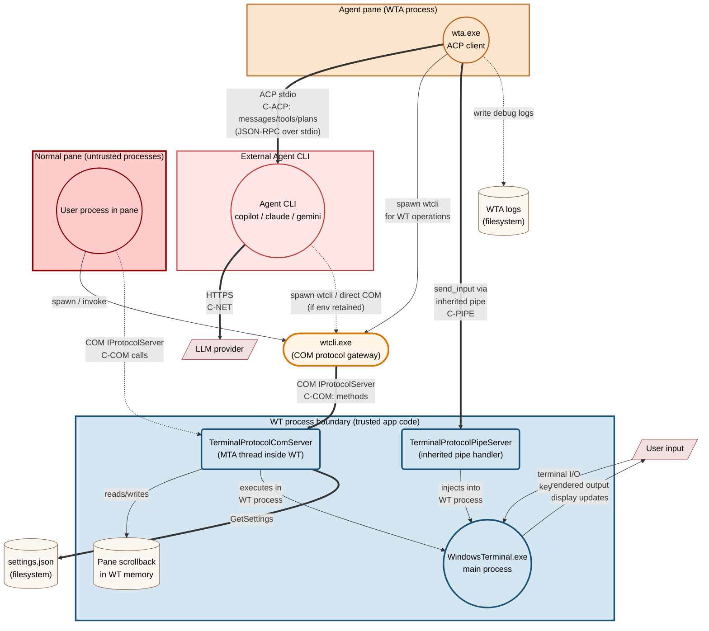

# Intelligent Terminal - Security Model & Threat Analysis

| Field | Value |
|---|---|
| **Document status** | Draft v1.2 |
| **Last updated** | 2026-05-12 |
| **Audience** | Microsoft internal security review |
| **Component** | Windows Terminal fork with embedded AI agents (WT + WTA + WTCLI) |

---

## 0. Review Scope and Security Boundary

This document reviews Intelligent Terminal against **application-level abuse by untrusted code running as the user**, especially code running inside a terminal pane or inside a semi-trusted Agent CLI. In scope are normal product surfaces and data flows: COM activation and method calls, `wtcli` / WTA helper commands, inherited environment variables, `settings.json`, WTA logs, VT / OSC output from pane processes, prompt injection, and Agent CLI behavior.

The inherited-pipe design is a **launch-time capability boundary**, not a same-user process isolation boundary. It is intended to prevent callers that only have COM access, environment-variable knowledge, process spawning ability, or ordinary child-process inheritance from invoking direct shell input. It does **not** claim to protect against same-user OS process-handle attacks such as opening WTA with `PROCESS_DUP_HANDLE`, duplicating WTA's pipe handle, or reading WTA process memory.

For this review, same-user OS process introspection and handle-table attacks against WTA are treated as out of scope. If reviewers require that capability to be in scope, the current inherited-pipe design is insufficient by itself; the mitigation would need OS-level isolation such as a restricted token, lower integrity, AppContainer/job isolation, tighter process DACLs, or a different IPC design with stronger client identity.

All residual-risk and mitigation statements below assume this boundary. If the boundary changes, the threat ratings and P0/P1 priorities must be revisited.

---

## 1. Executive Summary

Intelligent Terminal embeds AI agents into Windows Terminal. The security-sensitive capability is that agents can drive the user's terminal workflow: read pane output, create tabs or panes, and send input into shells.

The current model has two WT control planes:

1. **Terminal-scoped COM (`IProtocolServer`)** - used by `wtcli.exe`, WTA's fallback channel, and any direct COM client in an allowed activation context. This remains the main residual risk because it still exposes reads and several mutations.
2. **Per-WTA capability pipe** - an inherited anonymous pipe pair created by WT when it launches WTA. Direct shell input is routed here, not through COM.

Highest-priority residual risks:

| Risk | Why it matters | Current state |
|---|---|---|
| **Create/split over COM** | `CreateTab` / `SplitPane` can spawn attacker-chosen commands as WT children. | Still exposed through COM and stock `wtcli.exe`. |
| **Event broadcast disclosure** | Legacy `agent_event` envelopes are broadcast to every subscribed COM caller; a pane-context subscriber can passively observe other panes' agent prompts and tool calls. | No per-subscriber filtering; only platform COM activation policy gates `Subscribe`. |
| **Prompt injection** | Capability transport proves that WTA is authorized; it does not prove the LLM's requested action is safe. | Confirmation policy exists, but defaults are currently `auto` and are not fully propagated/enforced. |
| **Scrollback/log disclosure** | Pane output and WTA logs can contain tokens, source code, prompts, or command output. | Redaction is not implemented. |
| **Settings persistence via filesystem** | A process running as the user can overwrite `settings.json` and persistently weaken AI policy or change agent selection. | No meta-confirmation when WT reads policy-relevant settings and launches WTA / agent processes with those values. |

Key security claim under the §0 review boundary: shell input is capability-gated by inherited kernel handles (see §5.1 for the canonical statement and proof obligations). A caller with only terminal-scoped COM access cannot directly invoke `send_input`. This claim does not remove the remaining COM mutation surface.

---

## 2. System Overview

### 2.1 Components

| Component | Process | Identity / boundary notes |
|---|---|---|
| **WT** (`WindowsTerminal.exe`) | Long-lived UI host | Packaged desktop app running at medium integrity in the current configuration. Package-local paths are storage layout, not a low-privilege isolation boundary. |
| **WTA** (`wta.exe`) | Agent-pane TUI / delegate orchestrator | Production intent is packaged and co-located with WT, but development / PATH fallbacks exist. Shell-control authorization is granted to the resolved `wta.exe` via inherited pipe handles, so binary resolution and identity are part of the trust boundary. |
| **Agent CLI** | `copilot`, `claude`, `gemini`, `codex`, custom | Third-party child process spawned by WTA. Treated as semi-trusted. It inherits normal process environment unless scrubbed, including `WT_COM_CLSID`, so a compromised Agent CLI can also attempt COM access. |
| **WTCLI** (`wtcli.exe`) | CLI client to WT protocol | Package-private binary. Direct launch from ordinary external processes is denied by WindowsApps policy in tests, but a pane-launched process can call COM directly. |
| **TerminalProtocolComServer** | COM server inside WT | Registered as a local server class; exposes reads and several mutations. |
| **TerminalProtocolPipeServer** | Per-WTA pipe server inside WT | Accepts only pipe methods such as `hello` and `send_input` today. |

### 2.2 Communication channels

| Channel | Endpoints | Transport | Security control today |
|---|---|---|---|
| **C-COM** | `wtcli` / direct COM caller <-> WT | COM `IProtocolServer` (`CLSCTX_LOCAL_SERVER`) | Windows packaged-COM / terminal activation policy before method execution. Tested: ordinary external callers and arbitrary same-package callers were denied; Intelligent Terminal pane children were allowed. `WT_COM_CLSID` is a branding-routing hint only, not a secret or gate. |
| **C-PIPE** | WTA <-> WT | Two unidirectional anonymous pipes (one per direction), JSON-RPC over 4-byte little-endian frames | Launch-time inheritance and handle cleanup make the inherited kernel handle the capability. The numeric env vars are not capabilities. This does not defend against same-user handle duplication; see §5.1. |
| **C-ACP** | WTA <-> Agent CLI | JSON-RPC over parent-created stdio pipes | No separate auth. The Agent CLI is intentionally trusted with its stdio handles and inherits normal environment unless WTA explicitly removes variables. |
| **C-NET** | Agent CLI <-> LLM provider | HTTPS | Provider-managed auth/TLS; user data may leave the host. |
| **C-VT** | Shell <-> WT | ConPTY VT stream, including OSC marks | Not authenticated; pane output is attacker-controllable when the pane process is malicious. |
| **C-FS** | Processes <-> disk | `settings.json`, WTA logs | NTFS ACLs and package-local storage layout. This is not a sandbox boundary. |

### 2.3 Typical process tree

```text
WindowsTerminal.exe
+-- ConPTY -> user shell(s)
+-- ConPTY -> wta.exe agent pane
|   +-- Agent CLI
+-- hidden wta.exe delegate process(es)
    +-- Agent CLI
```

Per `TerminalPage`, there is at most one persistent shared agent-pane WTA. Delegation can create short-lived hidden WTA processes.

### 2.4 Data-flow diagram



Reading the DFD: the practical pane attacker path is `InPane -> COM -> WT state/scrollback/settings/topology`. A compromised Agent CLI can also reach the COM path if it inherits `WT_COM_CLSID`. The bold capability path is `WT <-> WTA` over inherited pipe handles; today it only carries direct shell input. Agent prompt context can flow from pane output to scrollback, through COM reads, through WTA and the Agent CLI, and then to the LLM provider.

### 2.5 Control-plane split

| Method group | COM (`IProtocolServer`) | Stock `wtcli.exe` verb | Per-WTA pipe |
|---|---:|---:|---:|
| `Authenticate`†, `GetCapabilities` | yes | yes | `hello` only |
| `ListWindows/Tabs/Panes`, `ReadPaneOutput`, `GetActivePane`, `GetProcessStatus` | yes | yes | no |
| `GetSettings`, `GetSessionVariable` | yes | no current verb | no |
| `CreateTab`, `SplitPane`, `ClosePane`, `FocusPane`, events | yes | yes | no |
| `SetSessionVariable` | yes | no current verb | no |
| Direct shell input | no | no | yes |

† `Authenticate` is currently a no-op: it ignores its `token` argument and unconditionally sets `_authenticated = true`. See §6 row "COM caller spoofing".

This split is intentional only for shell input. The remaining COM mutations (`CreateTab`, `SplitPane`, `ClosePane`, `FocusPane`, `SetSessionVariable`) are residual risk until migrated to the per-WTA pipe or otherwise restricted. The server capability list currently still advertises `set_settings` even though the IDL and stock `wtcli.exe` no longer expose a `SetSettings` method; remove that stale advertisement before the review.

### 2.6 WTA helper CLI surface

WTA also exposes helper commands for humans and agents (`list-windows`, `list-tabs`, `list-panes`, `new-tab`, `split-pane`, `capture-pane`, `kill-pane`, `active-pane`, `pane-status`, `listen`, and related aliases). These commands do not create a separate security boundary. They route WT operations through `CliChannel` / `wtcli.exe` / COM for reads and non-input mutations; only `send_input` can use the inherited pipe, and only when WTA was launched with those pipe handles.

---

## 3. Trust Boundaries and Assets

### 3.1 Trust boundaries

| Boundary | Flows | Enforcement |
|---|---|---|
| **WT <-> pane shell** | ConPTY stdin/stdout | ConPTY process isolation. WT injects terminal metadata such as `WT_SESSION`, `WT_PROFILE_ID`, and sometimes `WT_COM_CLSID`. |
| **WT <-> WTA pipe** | `send_input` and future capability-gated methods | Inherited kernel handles. Numeric env vars alone are not capabilities; invalid fake handles fail during inherit-flag clearing or I/O, and a valid unrelated handle still does not connect to WT. This is a launch-time inheritance boundary, not protection against same-user `PROCESS_DUP_HANDLE` handle theft from WTA. |
| **WTA <-> Agent CLI** | ACP stdio | Parent-created pipes. The Agent CLI is semi-trusted and inherits normal environment unless scrubbed; COM exposure from a compromised Agent CLI is therefore in scope. |
| **WT <-> COM callers** | `IProtocolServer` calls | Platform COM activation policy. The practical allowed attacker context observed so far is a process launched inside an Intelligent Terminal pane. |
| **All <-> filesystem** | settings and logs | NTFS ACLs. Package-local storage affects location, not privilege isolation. |

### 3.2 Assets

| Asset | Sensitivity | Notes |
|---|---|---|
| Shell stdin | Critical | Ability to execute commands as the user. |
| `settings.json` | Critical | Can change agent binaries, delegate behavior, and confirmation policy. |
| Pane scrollback | Sensitive | May include secrets, command output, source, or copied file contents. |
| Process environment | Sensitive | May include customer secrets. `WT_COM_CLSID` itself is non-secret routing metadata. |
| WTA logs | Sensitive | Per-process streams under `%LOCALAPPDATA%\IntelligentTerminal\logs\` (`wta-acp-debug.log`, `wta-delegate.log`, `wta-agent-pane.log`, `wta-attach.log`, `wta-ensure-host.log`). ACP request/response bodies and full Agent CLI commandlines are written verbatim; can contain prompts, file contents, API keys passed as arguments, and partial LLM responses. No rotation or redaction today. |
| Inherited pipe handles | Sensitive | Possession grants per-WTA shell-input capability. |

---

## 4. Threat Actors

| Actor | Capability | Main goal |
|---|---|---|
| **In-pane process** | Runs as the user in a terminal pane; can read env, spawn processes, and use network. In tests, pane children could activate WT COM even without package identity. | Attack other panes, persist, or exfiltrate data. |
| **Prompt-injected LLM** | Can ask the semi-trusted Agent CLI/WTA to perform harmful actions. | Convert untrusted text into agent action. |
| **Compromised Agent CLI** | Runs as WTA child with normal user privileges, ACP stdio access, and inherited environment such as `WT_COM_CLSID` unless scrubbed. | Drive WT operations exposed to WTA or call COM directly. |
| **WTA binary substitution / path hijack** | Controls a `wta.exe` resolved by development or PATH fallback before the intended packaged binary. | Receive inherited pipe handles and gain shell-input capability. |
| **Drive-by settings modifier** | Can write `settings.json` through the filesystem. | Persistently weaken future AI-session controls. |

Out of scope: kernel exploits, compromise of WT's own binaries, intentional abuse by the interactive logged-in user, and physical access. Untrusted code running as that user in a terminal pane remains in scope.

---

## 5. Key Data Paths

### 5.1 Shell input path

```text
LLM / Agent CLI
  -> WTA RoutedChannel
  -> inherited pipe JSON-RPC send_input
  -> TerminalProtocolPipeServer
  -> TerminalPage target lookup by WT_SESSION GUID
  -> TermControl / ControlCore
  -> ConPTY stdin
```

**Canonical capability statement.** Injecting keystrokes or commands into a shell pane (the `send_input` operation, which ultimately writes to ConPTY stdin) requires possession of the pipe handle that WT inherited to WTA at launch. The handle itself is the capability — no token, env var, identity check, or COM access substitutes for it. A process that does not hold the handle, and cannot duplicate it from WTA via same-user OS handle access, has no in-band path to this operation. The proof obligation is the table below; downstream sections refer back here rather than restating it.

| Step | Guarantee |
|---|---|
| WTA -> WT pipe | **Primary control:** kernel handle inheritance via `STARTUPINFOEX` + `PROC_THREAD_ATTRIBUTE_HANDLE_LIST` ensures only the launched WTA initially receives the handles. **Defense-in-depth:** WT-side handles are non-inheritable, and WTA scrubs `WT_PROTOCOL_PIPE_R/W` env vars and clears `HANDLE_FLAG_INHERIT` on its own copies so future grandchildren cannot inherit them. Only a process possessing the pipe handles can write valid frames. |
| Pipe method dispatch | Current allow-list accepts `hello` and `send_input`; unknown methods are rejected (`TerminalProtocolPipeServer.cpp:229,240`). |
| Target routing | `session_id` must parse as a non-empty GUID and match a pane by `Pane::FindPaneBySessionId`. There is no source-pane binding today; an authorized WTA can target any pane in the owning `TerminalPage` whose session GUID it knows. |
| Final write | `ControlCore` honors read-only mode before writing to the connection (`src/cascadia/TerminalControl/ControlCore.cpp`, `SendInput` / `_sendInputToConnection`). |

Non-guarantees: if the Agent CLI or LLM is prompt-injected and WTA is authorized, the pipe correctly carries the malicious request. If a same-user attacker can duplicate the pipe handles out of the WTA process, the inherited-handle design no longer distinguishes that attacker from WTA. These risks must be controlled by confirmation, insert-only mode, rate limiting, prompt hygiene, and OS-level process isolation if same-user handle theft is in scope.

### 5.2 Settings mutation path

```text
attacker-controlled user-context process (in-pane shell, Agent CLI, etc.)
  -> overwrite %LOCALAPPDATA%\...\settings.json
  -> future WT launch path reads weakened policy / attacker command
```

The mutation path is a direct filesystem write. This is not a new OS privilege — the attacker already runs as the user — but it persistently weakens AI policy without any in-band confirmation. An Agent CLI (semi-trusted) and a pane-context process can both reach the file: `settings.json` lives at a well-known per-user path that any user-context process can discover via `%LOCALAPPDATA%` or by enumerating package data, so path knowledge is not a meaningful gate. The mitigation is therefore at the *read* side: WT's settings-load / agent-launch path must meta-confirm changes to confirmation policy and agent command settings before honoring them, rather than relying on the file being write-protected.

---

## 6. Threat Table

| Threat | Category | Severity | Current control / gap |
|---|---|---:|---|
| COM caller spoofing | Spoofing | High | `Authenticate(token)` ignores its argument and unconditionally sets `_authenticated = true` (`TerminalProtocolComServer.cpp:268-288`). The `_authenticated` flag is not security-enforcing: only `Subscribe` (line 644) and `SendEvent` (line 663) even check it, and both are trivially passed by any caller that issues `Authenticate` first. No method is meaningfully gated by `_authenticated`. Platform COM activation policy is the only effective gate. |
| Event broadcast leaks cross-pane agent activity | Information disclosure | High | The legacy `agent_event` path calls `s_NotifyEventToComClients` (`TerminalProtocolComServer.cpp:698`; function body at line 174) and fans those envelopes out to every subscribed COM caller. A pane-context attacker that activates `IProtocolServer` and calls `Subscribe` can passively receive agent prompts and tool-call-style events across panes — no `ReadPaneOutput` invocation required. `autofix_state` and `agent_status` are direct-dispatch special cases, not broadcast on this path. No per-subscriber filtering today. |
| `CreateTab` / `SplitPane` arbitrary commandline | Tampering / app-boundary privilege expansion | High; Critical only if cross-integrity method access is ever allowed or the user accepts UAC elevation | Same-integrity WT gives same-user process creation and persistence. This is not OS privilege escalation in the normal non-elevated case. Elevated WT cross-integrity access was denied in tests when requesting `IProtocolServer`, but should remain a regression test. |
| `ReadPaneOutput` over COM | Information disclosure | High | Returns arbitrary scrollback; no redaction. |
| `GetSettings` / topology reads | Information disclosure | Medium | Reveals settings, cwd, pids, pane and tab topology. |
| COM DoS | Denial of service | Medium | No per-method rate limit; tab/pane churn can exhaust user-visible resources. |
| Pipe handle leakage to grandchildren | Spoofing / EoP | High | **Primary control:** `PROC_THREAD_ATTRIBUTE_HANDLE_LIST` confines inheritance to the WTA-side handles; arbitrary grandchildren do not get them by default. **Defense-in-depth:** WT-side handles are non-inheritable, and WTA strips `WT_PROTOCOL_PIPE_R/W` and clears `HANDLE_FLAG_INHERIT` before spawning the agent CLI. Future spawn-site changes that re-enable broad `bInheritHandles=TRUE` without an explicit handle list would defeat the primary control. |
| Same-user pipe handle duplication | Spoofing / EoP | High if same-user handle theft is in scope | The inherited-pipe design does not prevent a same-user process with sufficient OS rights from opening WTA and duplicating its pipe handles. If this attacker capability remains in scope, mitigation requires OS-level process isolation / restricted token / lower integrity or another handle-protection design. |
| Fake pipe handle env vars | Spoofing | Medium | Env vars are not capabilities. Fake or unrelated numeric handles do not connect to WT and fail during handle setup or I/O. |
| Oversized or malformed pipe frames | Tampering / DoS | Low | Both sides use 4-byte length frames with a 64 KiB cap. |
| Prompt-injected Agent CLI action | Tampering | High | Transport auth cannot solve this. Defaults are currently permissive (`auto`), and policy is not fully propagated. |
| Malicious Agent CLI binary | Supply chain / EoP | Medium | Built-in agent IDs can resolve through PATH / known locations; custom commands are explicit but not identity-pinned. The Agent CLI may inherit `WT_COM_CLSID`, so compromise can reach COM directly even if pipe env vars are scrubbed. |
| WTA binary substitution | Supply chain / EoP | High | Production intent is co-located packaged `wta.exe`, but `_DetectWtaPath()` also supports local dev and PATH fallbacks. Any resolved WTA binary receives the inherited pipe capability. |
| WTA logs contain secrets | Information disclosure | Medium | `wta-acp-debug.log` captures full ACP JSON-RPC frames (prompts, tool results, file contents); `wta-delegate.log` and `wta-agent-pane.log` capture Agent CLI commandlines, which routinely include API keys/tokens passed as arguments. No redaction or rotation today; logs persist until manually cleared. |
| Direct `settings.json` file write | Tampering | Critical for persistent AI-policy bypass; not OS privilege escalation | Inherits filesystem ACL behavior; no meta-confirmation for policy changes before WT honors the changed settings in future WTA / agent launches. |
| Crafted OSC marks for Autofix | Tampering | Medium | OSC 133 is shell-controlled. Execution still depends on agent recommendation and user interaction, but prompt injection remains relevant. |

### Notes on elevation

`CreateTab` / `SplitPane` impact varies by WT integrity context:

| Scenario | Impact |
|---|---|
| Normal non-elevated WT | Same-user process creation, persistence, and detection evasion. Not a privilege gain. |
| Attacker already inside elevated WT pane | Additional admin child process creation. This is admin-level persistence, not a new elevation because the caller is already admin. |
| Medium-integrity external caller to elevated WT | Tested `IProtocolServer` activation returned `E_ACCESSDENIED`; keep as regression coverage because WT does not set an explicit `CoInitializeSecurity` descriptor. |
| Elevated profile selected | User-assisted elevation if the attacker can trigger a UAC-backed elevated profile and the user approves. |

### Note on `PROC_THREAD_ATTRIBUTE_HANDLE_LIST`

When `bInheritHandles=TRUE` is used with `PROC_THREAD_ATTRIBUTE_HANDLE_LIST`, inheritance is constrained to the listed handles. This is safer than `bInheritHandles=TRUE` without an explicit handle list; it is not safer than inheriting no handles at all.

---

## 7. Mitigations

| Mitigation | Status | Covers |
|---|---|---|
| Move direct shell input off COM and into the per-WTA inherited pipe | Implemented | Direct keystroke injection by COM/`wtcli` callers |
| Migrate critical mutations (`CreateTab`, `SplitPane`, `SetSessionVariable`, `ClosePane`, `FocusPane`) to per-WTA capability gating or add equivalent caller restriction | Planned | Main COM residual risk |
| Add per-subscriber filtering / authorization for `Subscribe` + `SendEvent` so a pane-context COM subscriber cannot observe other panes' agent events | Roadmap | Event broadcast disclosure |
| Remove stale `set_settings` from `GetCapabilities()` | Not implemented | Review accuracy; prevents clients from relying on a non-existent COM method |
| Require confirmation for sensitive operations and for edits to confirmation policy itself | Partial / not enforcement-complete | Prompt injection, settings persistence |
| Default `aiIntegration.confirmation.{read,create,input}Operations` to `prompt` on fresh install (all three currently default to `auto` per `MTSMSettings.h`) | Not implemented | Prompt-injection blast radius |
| Strip `WT_PROTOCOL_PIPE_R/W` env vars and clear `HANDLE_FLAG_INHERIT` immediately in WTA | Implemented | Grandchild handle leakage |
| Scrub `WT_COM_CLSID` from Agent CLI environment or restrict COM independently | Planned | Compromised Agent CLI direct COM access |
| Length-framed pipe protocol with 64 KiB cap | Implemented | Pipe parser and memory DoS |
| Structured audit logging with WTA pid, source pane, target pane, and action type | Partial | Repudiation and incident response |
| Redact secrets in scrollback context and WTA logs | Roadmap | Exfiltration to LLM/log files |
| Insert-only mode for shell input recommendations | Partial | Reduces accidental execution; not universal for all `send_input` calls |
| Per-turn rate limit for shell-input calls | Roadmap | Agent runaway / prompt-injection loops |
| Pin or verify built-in Agent CLI binary identity | Partial — known-location / PATH resolution only; no signature pinning | Agent CLI supply chain |
| Pin or verify WTA binary identity and remove PATH fallback from production launches | Planned | WTA binary substitution |
| Autofix opt-in / first-run hardening | Not implemented; `autoFixEnabled` defaults to `true` | Surprise background analysis and prompt-injection exposure |

---

## 8. Residual Risks

1. **Terminal-scoped COM mutation surface.** Until critical mutations move off COM or receive equivalent authorization, a pane-context COM caller can affect other panes and future AI behavior.
2. **Event broadcast exfiltration.** The legacy `agent_event` path delivers events to every COM subscriber; a pane-context subscriber can passively observe other panes' agent activity until per-subscriber filtering is added.
3. **Prompt injection.** The pipe proves the caller has WTA's capability; it does not prove the LLM request is safe.
4. **Filesystem settings persistence.** Any user-context process can overwrite `settings.json` and persistently weaken confirmation policy or change agent selection for future WT launch paths.
5. **Scrollback exfiltration.** `ReadPaneOutput` can pass sensitive pane text to WTA and then to the Agent CLI / LLM provider.
6. **Log disclosure.** WTA logs may contain prompts, partial responses, and command lines.
7. **WTA binary substitution.** Any non-packaged fallback path that resolves an attacker-controlled `wta.exe` grants that binary the inherited pipe capability.
8. **Same-user handle duplication.** If same-user `PROCESS_DUP_HANDLE` attacks are in scope, inherited handles alone are not sufficient isolation.
9. **Platform-dependent COM security.** Cross-integrity COM behavior should be regression-tested with the real `IProtocolServer` IID or a harmless method such as `GetCapabilities`; `IUnknown`-only activation is not sufficient evidence.

> Regression-test scope (not present-state residual risk): current WTA handle hygiene is strong, but future spawn-site changes can reintroduce leaks if they enable broad handle inheritance. Add a regression test that asserts `WT_PROTOCOL_PIPE_R/W` are unset in the Agent CLI environment and that the `HANDLE_FLAG_INHERIT` bit is cleared on WTA's copies before any grandchild spawn.

---

## 9. Hardening Roadmap

| Priority | Item |
|---|---|
| **P0** | Move `CreateTab`, `SplitPane`, `SetSessionVariable`, `ClosePane`, `FocusPane` behind per-WTA capability gating or equivalent explicit authorization. |
| **P0** | Add per-subscriber filtering / authorization to `Subscribe` + `SendEvent` so a pane-context COM subscriber cannot passively observe other panes' agent events. |
| **P0** | Change fresh-install confirmation defaults from `auto` to `prompt`; enforce policy in WTA launch/runtime paths. |
| **P0** | Remove stale `set_settings` from `IProtocolServer::GetCapabilities()`. |
| **P1** | Add meta-confirmation for changes to `aiIntegration.confirmation.*` and agent command settings in the WT settings-load / agent-launch path. |
| **P1** | Scrub `WT_COM_CLSID` from Agent CLI child environments, or make COM authorization independent of inherited pane environment. |
| **P1** | Add structured audit logging and log rotation. |
| **P1** | Add redaction for pane context and WTA logs. |
| **P1** | Add per-turn shell-input rate limiting. |
| **P1** | Add source-pane / target-pane authorization for pipe `send_input`, or explicitly document that WTA may target any pane by session GUID. |
| **P2** | Migrate read methods (`ReadPaneOutput`, `GetSettings`, topology reads) after mutation methods. |
| **P2** | Tighten built-in Agent CLI resolution and binary identity checks (signature pinning, not just known-location). |
| **P2** | Tighten WTA resolution: prefer co-located packaged WTA only in production and gate dev / PATH fallback behind debug settings. |
| **P2** | Autofix opt-in / first-run hardening — change `autoFixEnabled` default to `false` (or surface a first-run prompt) so background analysis is not enabled by surprise. |
| **P3** | If same-user handle theft remains in scope, evaluate lower-integrity / restricted-token WTA or another OS-level handle-protection design. |
| **P3** | Consider explicit COM security descriptor / caller allow-list once legitimate callers are reduced. |

---

## 10. Open Questions

1. Do reviewers accept the §0 boundary that same-user OS handle-table / process-memory attacks against WTA are out of scope?
2. Should WT or helper processes run with a more restricted token or lower integrity level?
3. Should `WTA` specifically run at a lower integrity level than the user — given it brokers shell input on behalf of a semi-trusted Agent CLI — even if WT itself does not?
4. Can WT/WTA scrub `WT_COM_CLSID` from Agent CLI children without breaking legitimate agent tooling?
5. Can Agent CLI and WTA binary identity be verified without breaking user-installed CLI workflows?
6. Are WTA logs ever collected by telemetry or support tooling? If yes, redaction becomes mandatory rather than best effort.
7. Should `settings.json` ACLs be tightened beyond inherited per-user filesystem defaults?

---

## 11. References

- `src/cascadia/TerminalApp/WtaProcessLauncher.{h,cpp}` - pipe creation and WTA launch
- `src/cascadia/TerminalApp/TerminalProtocolPipeServer.{h,cpp}` - inherited-pipe JSON-RPC server
- `src/cascadia/TerminalConnection/ConptyConnection.{h,cpp}` - agent-pane WTA launch with inherited handles
- `src/cascadia/WindowsTerminal/TerminalProtocolComServer.{h,cpp}` - COM surface
- `src/cascadia/TerminalProtocol/TerminalProtocol.idl` - protocol interface
- `wta/src/shell/wt_channel/pipe_channel.rs` - WTA inherited-pipe client
- `wta/src/shell/wt_channel/routed_channel.rs` - pipe-vs-COM method routing
- `wta/src/shell/wt_channel/cli_channel.rs` - `wtcli` fallback transport
- `src/tools/wtcli/main.cpp` - CLI surface
- STRIDE methodology
