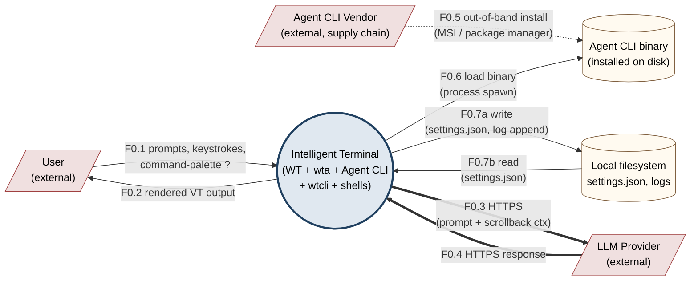
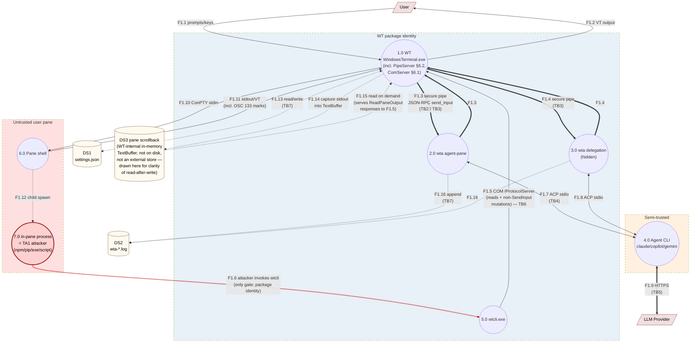
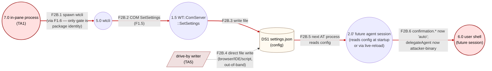

# Intelligent Terminal — Security Model & Threat Analysis

| Field | Value |
|---|---|
| **Document status** | Draft v1.0 |
| **Last updated** | 2026-05-08 |
| **Audience** | Microsoft internal security review |
| **Authors** | Intelligent Terminal team |
| **Component** | Windows Terminal fork with embedded AI agents (WT + WTA + WTCLI) |

---

## 1. Executive Summary

Intelligent Terminal is a fork of Windows Terminal that embeds AI assistants (Copilot, Claude, Gemini, custom agents) into the user's terminal workflow. The defining capability — and the dominant security concern — is that AI agents can **drive the user's shells**: they can read pane scrollback, type commands into other panes, open new tabs and panes, and modify settings.

This document analyses the threat model for that capability surface. The primary attacker classes are (a) **in-pane processes** that the user accidentally launches (malicious npm packages, scripts, exes), (b) **prompt-injection** of the LLM via untrusted content the agent reads (a website, a log, a `cat`'d file), and (c) **third-party agent CLIs** (`claude`, `copilot`, `codex`, `gemini`) that we treat as semi-trusted black boxes.

The most security-relevant change since the upstream Windows Terminal baseline is moving the `SendInput` keystroke-injection primitive **off** the COM-callable `IProtocolServer` interface and onto a **per-wta inherited duplex pipe pair** (Section 8.1). This converts SendInput from "any caller with package identity that can find the well-known CLSID" to "only the wta processes WT itself spawned, holding kernel handles passed via `STARTUPINFOEX HANDLE_LIST` — a kernel-verified, per-process capability". The rest of the COM surface is still ambient-callable; that gap is documented in Section 8.2 and 8.3.

The remaining sections enumerate trust boundaries, assets, threat actors, and a STRIDE table per component.

---

## 2. System Overview

### 2.1 Components

| Component | Process | Identity | Lives where |
|---|---|---|---|
| **WT** (`WindowsTerminal.exe`) | Long-lived UI host | Packaged (AppContainer-eligible) | One per user session (or per window group) |
| **WTA** (`wta.exe`) | TUI agent / orchestrator (Rust) | Packaged (co-located with WT) | At most **one persistent agent-pane wta** per `TerminalPage` (the "single shared agent pane" — see `TerminalPage::_agentPane`, `_FindAgentPane`); plus **one short-lived hidden wta per `?<prompt>` delegation** (concurrent delegations allowed) |
| **Agent CLI** | Third-party LLM client (`claude`, `copilot`, `gemini`, `codex`, custom) | User-installed binary | Spawned by WTA, child of WTA |
| **WTCLI** (`wtcli.exe`) | CLI client to WT protocol | Packaged | Runnable by any caller that can spawn it with package identity. Reads `WT_COM_CLSID` env var as a branding-routing hint — **not** a security gate (CLSID is hardcoded per branding in source) |
| **TerminalProtocolComServer** | Out-of-proc COM server, MTA thread | Inside WT, co-marshalled via MBM | Per WT process |
| **TerminalProtocolPipeServer** | Per-wta JSON-RPC IO thread | Inside WT (TerminalApp.dll) | One per launched wta |

### 2.2 Communication Channels

| Channel | Endpoints | Transport | Security control today |
|---|---|---|---|
| **C-COM** | wtcli ↔ WT | COM `IProtocolServer` (CLSCTX_LOCAL_SERVER); CLSID is hardcoded per branding in `TerminalProtocolComServer.h` and **is not a secret** | **Caller package identity is the only enforceable gate.** `WT_COM_CLSID` env var is a discovery / branding-routing hint only |
| **C-PIPE** | wta ↔ WT | Anonymous duplex pipe pair, JSON-RPC 2.0 over 4-byte LE length frames | **Kernel handle inheritance** (PROC_THREAD_ATTRIBUTE_HANDLE_LIST) — this document's centerpiece |
| **C-ACP** | wta ↔ Agent CLI | JSON-RPC 2.0 over stdio (Agent Control Protocol) | Process tree (parent/child); `_writeOverlapped` event isolation |
| **C-NET** | Agent CLI ↔ LLM provider | HTTPS (out of our control) | Provider-managed (API keys, TLS) |
| **C-VT** | shell ↔ WT | OSC sequences in PTY output stream (e.g. OSC 133, OSC 9001) | None — content of the stream is not authenticated |
| **C-FS** | All ↔ disk | settings.json, log files | NTFS ACLs (per-user packaged sandbox) |

### 2.3 Process Tree (typical)

```
WindowsTerminal.exe                                  (packaged)
├── ConPTY → user shell (PowerShell, bash, …)        (one per user pane; many)
├── ConPTY → wta.exe (the agent pane)                (AT MOST ONE per TerminalPage,
│   └── claude.exe / copilot.exe / …                  packaged, inherits PIPE_R/W)
└── (hidden) wta.exe delegate …                      (zero or more; one per
    └── claude.exe / …                                ?<prompt>; short-lived)
```

**Cardinality clarification.** Per WT `TerminalPage` (≈ per WT window), there is **at most one** persistent wta — the "single shared agent pane" managed via `TerminalPage::_agentPane` (a `weak_ptr<Pane>`, not a collection). Subsequent calls to `_OpenOrReuseAgentPane` find the existing pane via `_FindAgentPane()` and reuse it. Multi-window scenarios (multiple `TerminalPage` instances under one `WindowEmperor`) can produce one persistent wta per window, but each window's wta is independent.

### 2.4 DFDs — overview

This document uses three levels of Data-Flow Diagram

| Level | Purpose |
|---|---|
| **Level 0** (§2.5) | Context diagram — system as a single process, all external actors and data stores |
| **Level 1** (§2.6) | System DFD — every internal process, every cross-boundary data flow, all trust boundaries drawn |
| **Level 2** (§2.7, §2.8) | Per-critical-area decomposition — SendInput path (post-fix) and settings.json mutation surface |

DFD symbol convention: **circles** are processes (we use rounded boxes in Mermaid for compatibility), **rectangles** are external entities, **cylinders** are data stores, **dashed boxes** are trust boundaries, **arrows** are data flows (numbered `Fn`). The flow numbering established in §2.6 is reused throughout §3 (trust boundaries) and §6 (STRIDE tables).

**Numbering convention.** Top-level processes get integer IDs (`1.0` WT, `2.0` wta agent-pane, `3.0` wta delegation, `4.0` Agent CLI, `5.0` wtcli, `6.0` pane shell, `7.0` in-pane process). Level 2 decompositions of process `N` use `N.1`, `N.2`, … (e.g. `1.1` WT::PipeServer is a sub-component of `1.0` WT). Data stores are `DS<n>`. Flows are `F<level>.<seq>` (`F0.x` for L0, `F1.x` for L1, `F2A.x` and `F2B.x` for the two L2 diagrams).

If your viewer does not render Mermaid, the diagrams below can be exported with `mmdc -i security-model.md -o ./images/`.

### 2.5 Level 0 — Context diagram



**Reading the L0:** the system has three external trust counterparties — the User (trusted), the LLM Provider (semi-trusted, sees prompts), and the Agent CLI Vendor (semi-trusted, supplies the binary that interprets LLM output). The double-line arrows (F0.3, F0.4) cross the most security-relevant external boundary: HTTPS to a third-party LLM, where prompt content (which can contain pane scrollback) leaves the host.

### 2.6 Level 1 — System DFD



**Reading the L1.** Three trust zones, color-coded:

- **Blue (WT package identity):** the four packaged processes that share a code-signed identity. The pipe transport (F1.3, F1.4) crosses **inside** this zone via kernel handle inheritance — capability cannot be regranted, see §7.1.
- **Tan (semi-trusted):** the Agent CLI runs as wta's child but is third-party code. ACP (F1.7, F1.8) crosses TB4. Network egress (F1.9) crosses TB5.
- **Red (untrusted user pane):** the user's shell and any process it spawns. F1.6 is the attack we eliminated for `SendInput`: in-pane process inherits **package context** from its WT-spawned parent shell, spawns wtcli, calls into WT. The CLSID is hardcoded per branding and publicly known; `WT_COM_CLSID` env var is just a routing hint, **not the gate** — the actual gate is package identity. Post-fix wtcli still has F1.5 (read methods + non-SendInput mutations); SendInput specifically does not flow over F1.5 anymore.

**Key observation visible in the diagram:** the **scrollback exfiltration / prompt-injection chain** is:

```
F1.11 (shell stdout)
  → F1.14 (WT captures into DS3 TextBuffer)
  → F1.5 (wta-spawned wtcli requests ReadPaneOutput via COM)
  → F1.15 (DS3 read on demand, response over F1.5 reverse)
  → wtcli stdout pipe → wta
  → F1.7 (wta forwards as prompt context over ACP)
  → F1.9 (Agent CLI HTTPS to LLM)
```

Anything an in-pane process echoes (F1.11) can:
1. Reach the LLM as prompt context (above chain) — **information disclosure**
2. Become an instruction the LLM follows, returned as a `send_input` request over F1.3 — **prompt-injection (R2 in §10)**

Note that scrollback retrieval **today goes through wtcli/COM** (CliChannel routes `read_pane_output` to `wtcli capture-pane`); it does **not** flow over the new secure pipe. M-2's read-method migration would move it.

### 2.7 Level 2 — SendInput data path (post-fix)

Refines F1.3/F1.4 from the L1, showing the in-process detail of how `send_input` traverses WT.

```mermaid
flowchart LR
    Attacker[/"untrusted content<br/>(in scrollback / web / file<br/>read by Agent CLI)"/]
    LLM[/LLM Provider/]
    ACLI(("4.0 Agent CLI"))
    WTA(("2.0 wta<br/>RoutedChannel"))
    PipeSrv(("1.1 WT::PipeServer<br/>(IO thread)"))
    TermPage(("1.2 WT::TerminalPage<br/>::SendProtocolInput"))
    TermCtl(("1.3 WT::TermControl<br/>::SendInput"))
    Core(("1.4 WT::ControlCore<br/>::SendInput"))
    Shell[("DS:<br/>shell stdin<br/>via ConPTY")]

    Attacker -. "F2A.1 reaches LLM as<br/>injected instruction" .-> LLM
    LLM == "F2A.2 (F0.4) ACP-shaped<br/>response: 'send dir to pane 1'" ==> ACLI
    ACLI -- "F2A.3 (F1.7) ACP req<br/>{action:'send', parent:1, input:'dir'}" --> WTA
    WTA == "F2A.4 (F1.3) JSON-RPC frame<br/>method=send_input<br/>over inherited pipe" ==> PipeSrv
    PipeSrv -- "F2A.5 dispatch<br/>(UI dispatcher)" --> TermPage
    TermPage -- "F2A.6 find pane by<br/>ContentId tree-walk" --> TermCtl
    TermCtl -- "F2A.7 RawWriteString" --> Core
    Core -- "F2A.8 _connection.WriteInput<br/>(read-only check)" --> Shell

    classDef ext fill:#f0e0e0,stroke:#a04040,color:#000
    classDef ds fill:#fffaf0,stroke:#806040,color:#000
    classDef pipe stroke-dasharray:5 5,stroke-width:3px,fill:#fff8e0,color:#000
    class Attacker,LLM ext
    class Shell ds
    class WTA,PipeSrv pipe

    linkStyle 3 stroke:#c00000,stroke-width:3px
```



**Where the security guarantees apply:**

| Step | Guarantee | Source |
|---|---|---|
| F2A.4 (the bold red flow) | Capability-bound: only a process that **inherited** the pipe handles can send this frame. An attacker with package identity (e.g. an in-pane process that can spawn wtcli) cannot forge this — the handle is kernel-verified per-process. | §7.1, M-1, M-4 |
| F2A.5 | Method allow-list enforced — `_methods` map only registers `hello` and `send_input` today. | §6.2 P-6 |
| F2A.6 | `paneId` validated against `ContentId` tree-walk; non-existent or wrong-process panes fail closed. | §6.2 P-8 |
| F2A.8 | `ControlCore::SendInput` honours read-only mode flag; pane-level lockout still applies. | §6.2 P-8 |

**Where the security guarantees do NOT apply** (residual): F2A.1 — F2A.4 itself. If the LLM is prompt-injected and the user has `aiIntegration.confirmation.inputOperations = auto`, the injected `send_input` reaches F2A.5 with full authorisation. This is R2 in §10; mitigations are M-11/M-12/M-13.

### 2.8 Level 2 — settings.json mutation path (current threat — R3)

Refines F1.5/F1.13 from the L1, showing the persistent-EoP loop that is the highest-severity unmitigated risk.



**Why this is R3 / single-highest residual risk:** the chain F2B.1 → F2B.6 is **not gated by user confirmation today**. Any in-pane attacker (TA1) who runs once for a few seconds gets persistent agent behaviour change. M-2 (move `SetSettings` off COM onto the per-wta pipe) is the canonical mitigation. M-7 (require confirmation for confirmation-policy edits — meta-confirmation) is a secondary backstop that helps even before M-2 lands.

---

## 3. Trust Boundaries

Boundaries are referenced from §2.6 (Level 1 DFD) and §6 (STRIDE tables).

| ID | Boundary | L1 flows that cross it | Enforcement |
|---|---|---|---|
| **TB1** | WT ↔ in-pane shell | F1.10, F1.11 | ConPTY isolation; parent-child relationship; package identity inherited |
| **TB2** | WT ↔ WTA (agent-pane) | F1.3 | **Kernel handle inheritance via STARTUPINFOEX HANDLE_LIST**; wt-side handles non-inheritable; wta strips `HANDLE_FLAG_INHERIT` at startup |
| **TB3** | WT ↔ WTA (delegation, hidden) | F1.4 | Same as TB2 |
| **TB4** | WTA ↔ Agent CLI | F1.7, F1.8 | Parent-child stdin/stdout; no auth (we own the spawn) |
| **TB5** | Agent CLI ↔ LLM | F1.9 | TLS, provider's API key auth — not our concern, but user data leaves the host here |
| **TB6** | WT ↔ wtcli (and **any** caller of `IProtocolServer`) | F1.5, F1.6 | **Caller package identity is the only enforceable gate.** The CLSID is hardcoded per branding in source and is publicly known; `WT_COM_CLSID` env var is a branding-routing hint, not a security control. Any in-pane process inherits package context trivially via shell spawn; non-WT-pane processes can also reach the surface if they obtain package identity through Windows packaging activation APIs. |
| **TB7** | All ↔ on-disk filesystem (settings.json, logs) | F1.13, F1.16 | NTFS ACLs (packaged sandbox redirects). DS3 (scrollback) is **in-memory inside WT and does not cross TB7** — F1.14 / F1.15 are intra-process. |
| **TB8** | wta ↔ wta's grandchildren | (intra-process: between `WT_PROTOCOL_PIPE_R/W` env-read and child spawn in wta) | wta's spawn flags (no `HANDLE_FLAG_INHERIT` on pipe handles after `from_env`) |

**Critical observation (TB6):** package identity is the only enforceable gate on `IProtocolServer`. Any malicious npm/pip/exe in the user's pane already has the necessary identity (inherited via `ConptyConnection::_LaunchAttachedClient`'s shell spawn) and can call `IProtocolServer` methods — directly or by spawning the packaged `wtcli.exe`. The `WT_COM_CLSID` env var that wtcli reads is just a branding-routing hint; it is not a secret and it is not a gate. **This is the dominant ambient surface and the reason SendInput had to be moved off it.**

---

## 4. Assets and Sensitivity

| ID | Asset | Sensitivity | Notes |
|---|---|---|---|
| **A1** | User shell stdin (i.e. ability to execute commands as the user) | **P0 — Critical** | `SendInput`, `CreateTab/SplitPane` (with arbitrary `commandline`), `SetSessionVariable` all touch this directly or indirectly |
| **A2** | `settings.json` | **P0 — Critical** | Modifying it can change `acpAgent`, `delegateAgent`, `aiIntegration.confirmation.*`, `aiIntegration.coordinator.commandline` — ⇒ persistent privilege escalation for any future AI session |
| **A3** | Pane scrollback content | **P1 — Sensitive** | Often contains echoed tokens, API keys, session cookies, source code, file contents from `cat`, `Get-Content`, etc. Read by `ReadPaneOutput`. Major exfiltration channel via TB5 (LLM provider) |
| **A4** | Process environment variables (current pane) | **P1 — Sensitive** | Includes `WT_COM_CLSID`, possibly customer API keys |
| **A5** | Active session VT streams (OSC 133 marks, exit codes, prompt boundaries) | **P2 — Internal** | Used by Autofix; leak signals shell behaviour but not data |
| **A6** | Pane / tab / window topology | **P2 — Internal** | Reconnaissance: which PIDs are in which pane |
| **A7** | Log files (`wta-*.log`) | **P1 — Sensitive** | Contains agent prompts, partial responses, command lines. May contain token-shaped strings echoed by user |
| **A8** | Inherited pipe HANDLE values (`WT_PROTOCOL_PIPE_R/W` env vars in wta) | **P1 — Sensitive** | If leaked into a grandchild process, that process gains SendInput capability |

---

## 5. Threat Actors

| ID | Actor | Capability | Motivation |
|---|---|---|---|
| **TA1** | **In-pane process** (malicious npm/pip/exe/script run by the user) | Read env, spawn children, network access, full user-mode privilege; **inherits package identity** from the parent shell (the actual gate to `IProtocolServer`). Can launch packaged `wtcli.exe` to attack the COM surface. | Lateral movement into other panes, persistence, exfiltration |
| **TA2** | **Prompt-injected LLM** (LLM follows instructions hidden in untrusted content the agent reads — webpage, log, file) | Whatever the agent CLI lets it do — issue ACP `send_input`, `create_tab`, etc. | Cause agent to run attacker-chosen commands |
| **TA3** | **Compromised Agent CLI binary** | Full process privilege of wta's child | Run anything wta is willing to drive |
| **TA4** | **Co-resident user / process** (multi-user box; a less-privileged process trying to escalate) | Other-user-level access to %LOCALAPPDATA% redirected paths | Read logs, read settings.json |
| **TA5** | **Drive-by `settings.json` modifier** (browser download, clipboard injection, msedge handoff that writes the file) | Filesystem write to the settings file path | Persistent agent behaviour change |
| **TA6** | **Stale CLSID / vtable client** (older wtcli or third-party caller against new IDL) | COM client with stale projection | Mostly DoS / accidental misuse, not adversarial |

Out of scope: kernel exploits, supply-chain compromise of WT itself, malicious user, physical access.

---

## 6. STRIDE — Per Component

The following sections enumerate threats per component using the standard STRIDE categories: **S**poofing, **T**ampering, **R**epudiation, **I**nformation disclosure, **D**enial of service, **E**levation of privilege.

Severity is on a 4-point scale: **Critical / High / Medium / Low**.
Each row links to a mitigation in Section 9.

### 6.1 `IProtocolServer` (COM, in WT) — `TerminalProtocolComServer`

Activated via `CoCreateInstance(CLSCTX_LOCAL_SERVER)` against a **per-branding hardcoded CLSID** (see `TerminalProtocolComServer.h` — 4 fixed UUIDs by branding). The `WT_COM_CLSID` env var WT advertises is a discovery convenience for multi-branding scenarios; **the CLSID is publicly known and is not a security gate**. The only enforceable activation gate is **caller package identity**. **Authentication is currently a `dev bypass`** (any token accepted; see `Authenticate(token)` impl).

| ID | STRIDE | Threat | Severity | Mitigation |
|---|---|---|---|---|
| C-1 | **S** | Any caller with package identity can spoof a legitimate caller (CLSID is publicly known; no caller-PID/identity check; `Authenticate` is a dev-bypass). In-pane processes have package identity trivially via inheritance. | **High** | M-1, M-2 (partial), M-9 |
| C-2 | **T** | `SetSettings(content)` lets a caller overwrite `settings.json` (replacing `acpAgent`, removing `confirmation.*` prompts) | **Critical** | M-2 (planned), M-7 |
| C-3 | **T** | `CreateTab` / `SplitPane` accept arbitrary `commandline` → arbitrary process spawn under WT package identity | **Critical** | M-2 (planned), M-7 |
| C-4 | **T** | `SetSessionVariable(paneId, name, value)` writes env into a pane's shell — can prepend `PATH=`, set `LD_PRELOAD`-equivalent | **High** | M-2 (planned), M-7 |
| C-5 | **R** | No authenticated caller identity; SetSettings creates a backup but the **action attribution** is "some process with package identity" — no PID, no name, no chain of custody | **Medium** | M-3 |
| C-6 | **I** | `ReadPaneOutput` returns arbitrary scrollback lines including secrets that scrolled through pane | **High** | M-7, M-8 |
| C-7 | **I** | `ListPanes`, `ListTabs`, `GetActivePane` give topology / `Cwd` / `Pid` — useful reconnaissance | **Medium** | M-2 (caller restriction), M-7 |
| C-8 | **I** | `GetSettings` returns the entire `settings.json` (may contain custom commandlines, secrets users put in profiles) | **Medium** | M-2, M-7 |
| C-9 | **D** | Repeated `QuickPick(..., allowFreeInput)` blocks the UI thread; spammed `CreateTab` can exhaust window resources | **Medium** | M-10 |
| C-10 | **E** | Combined: in-pane process → wtcli → SetSettings to weaken confirmation → next agent action runs unprompted = persistent EoP | **Critical** | M-2, M-7 |

**Note on `SendInput` (now removed from this interface):** what was previously the highest-severity entry on this table — SendInput as ambient COM — is **eliminated** as of the secure-pipe change. See Section 8.1.

### 6.2 `TerminalProtocolPipeServer` (per-wta pipe, in WT)

One IO thread per launched wta. Reads JSON-RPC frames, dispatches to handlers (currently only `send_input` and the `hello` handshake). The wt-side handles are owned by `TerminalPage` for the lifetime of the wta process; they are **non-inheritable** (locked at pipe creation via `SetHandleInformation`).

| ID | STRIDE | Threat | Severity | Mitigation |
|---|---|---|---|---|
| P-1 | **S** | A grandchild of wta inherits the pipe handles via accidental `bInheritHandles=TRUE` and impersonates wta on the pipe | **High** | M-4 (HANDLE_FLAG_INHERIT cleared at wta startup), M-5 |
| P-2 | **S** | A wta-side bug duplicates the handle to another process via `DuplicateHandle` | **Medium** | M-4 (audit comment near `OwnedHandle`), M-5 |
| P-3 | **T** | Malformed JSON / oversized frame causes parser/buffer issue | **Low** | M-6 (4-byte LE length cap, 64 KiB hard limit; jsoncpp bounded parse) |
| P-4 | **T** | Replay: a captured frame is replayed by an attacker who somehow reaches the pipe | **Low** | (Not directly mitigated — out of threat scope; would require handle leakage to start) |
| P-5 | **R** | `send_input` calls aren't logged with caller pid | **Low** | M-3 (planned: log handshake's reported pid + each send_input) |
| P-6 | **I** | A method handler returns more data than caller is authorized for | **Low** | (Currently only `send_input` exists; future methods need per-method audit) |
| P-7 | **D** | wta blocks on a large frame; IO thread back-pressure | **Low** | M-6 (length caps, blocking ReadFile on a single thread per pipe — a bad client only DoSes its own channel) |
| P-8 | **E** | Pipe handler invokes `TerminalPage::SendProtocolInput` which routes to `TermControl::SendInput`. If `SendProtocolInput` doesn't validate `paneId`, attacker hits any pane. | **Medium** | M-7 (paneId is matched against `ContentId` on tab-tree walk; only existing panes match), M-8 (read-only mode check in `ControlCore::SendInput`) |

**Defining property of this surface:** capability to call `send_input` is held in a kernel handle, not a string. There is no "discovery" mechanism — the handle either was inherited at process creation, or it wasn't. Loss of this capability does NOT regrant via env var, registry, COM lookup, or filesystem.

### 6.3 `wtcli.exe`

User-facing CLI that calls `IProtocolServer` via COM. Reads `WT_COM_CLSID` for branding-routing (which CLSID to activate for the running WT) but **the actual activation gate is the caller's package identity**, satisfied as long as wtcli is spawned by a packaged caller (e.g. an in-pane shell whose context was set up by WT).

| ID | STRIDE | Threat | Severity | Mitigation |
|---|---|---|---|---|
| W-1 | **S** | Any caller with package identity can spawn `wtcli` (or directly `CoCreateInstance` from a packaged binary) and act as a legitimate caller. `WT_COM_CLSID` is **not** a gate. | **High** | M-1, M-2 |
| W-2 | **T** | `wtcli set-settings` writes settings.json | **High** | M-2, M-7 |
| W-3 | **T** | `wtcli new-tab -c '<cmdline>'` spawns arbitrary process | **Critical** | M-2, M-7 |
| W-4 | **I** | `wtcli capture-pane`, `list-panes`, `info` enumerate state for reconnaissance | **Medium** | M-2, M-7 |
| W-5 | **D** | `wtcli kill-pane` repeatedly closes panes; can race agent's open-and-send flows | **Low** | (Accepted: pane lifetime is user-controlled; closed pane is immediately observable) |
| W-6 | **E** | `wtcli` was the canonical path for `send-keys`; **removed in the SendInput hardening** so this row is closed | n/a | Mitigated (M-1) |

### 6.4 WTA process (`wta.exe`)

Two flavours: the **single persistent agent-pane wta** (long-lived; at most one per `TerminalPage`, see §2.3), and **short-lived delegation wtas** (one per `?<prompt>`, hidden, concurrent). Always packaged (co-located with WT under the same package identity, otherwise COM activation fails with `0x80073D54`).

| ID | STRIDE | Threat | Severity | Mitigation |
|---|---|---|---|---|
| A-1 | **S** | An attacker spawns `wta.exe` (or any other packaged binary in the package) with `WT_PROTOCOL_PIPE_R/W` set to fake handle values, hoping to bypass the secure-pipe gate | **Medium** | M-4: the handles must be **actually inherited** kernel handles in *this* process to be valid. Arbitrary numbers fail when `OwnedHandle::from_raw_handle` is used because the kernel handle table doesn't contain them — fails with read EOF / write error; M-5. (For the COM surface, `WT_COM_CLSID` is **not** a gate per §6.1, so spoofing the env var doesn't grant new capability either.) |
| A-2 | **T** | The Agent CLI returns ACP-shaped data crafted to make wta call `send_input` with attacker-chosen text | **High** (this is the **prompt-injection root case**) | M-11 (confirmation gates), M-12 (insert-only mode), M-13 (rate limits) |
| A-3 | **T** | Malicious agent CLI binary on PATH | **Medium** | M-14 (settings explicitly name the agent binary path; PATH lookup is opt-in) |
| A-4 | **R** | Agent action attribution: was the action driven by the LLM or by the user? | **Medium** | M-3 (every action logged with prompt context, choice number, recommendation source) |
| A-5 | **I** | wta logs (`wta-acp-debug.log` etc.) contain the LLM prompt and partial response — can include user input | **Medium** | M-3 (log rotation), M-15 (log redaction roadmap) |
| A-6 | **I** | Pipe handle values are exposed in `WT_PROTOCOL_PIPE_R/W` env vars at startup. Any code in wta's process **before** they are read can inspect / leak them | **Medium** | M-4 (`PipeChannel::from_env` consumes the vars via `std::env::remove_var` and immediately strips `HANDLE_FLAG_INHERIT`) |
| A-7 | **D** | Malformed JSON-RPC frame from WT to wta causes wta to crash | **Low** | wta side has length caps + frame parsing errors are surfaced as `bail!` (transport marked dead, falls back) |
| A-8 | **E** | wta spawns the Agent CLI with `bInheritHandles=TRUE` and no HANDLE_LIST → leaks pipe handles into the agent CLI process | **High** | M-4 (defense-in-depth: HANDLE_FLAG_INHERIT cleared at startup; even with bInheritHandles=TRUE the handles do not propagate). Also: requires audit of the spawn site. |

### 6.5 ACP channel (wta ↔ Agent CLI)

stdio JSON-RPC. Agent CLI is wta's child process; we own the spawn parameters.

| ID | STRIDE | Threat | Severity | Mitigation |
|---|---|---|---|---|
| AP-1 | **S** | A non-child process attaches to wta's stdin/stdout (Win32: hard, requires already-elevated access) | **Low** | OS-level (parent-child handle inheritance; no namespace) |
| AP-2 | **T** | Agent CLI sends ACP messages instructing destructive operations | **High** (the actual TA2 surface) | M-11, M-12 |
| AP-3 | **R** | ACP traffic is logged; correlation between ACP request and resulting `send_input` is recoverable | n/a | M-3 |
| AP-4 | **I** | ACP messages contain user prompts — leak via stdio file descriptor inheritance to grandchildren | **Low** | wta closes inherited fds before spawning agent CLI's children; stdio is per-pipe |
| AP-5 | **D** | Agent CLI sends infinite stream → wta's reader buffer grows | **Low** | tokio framed reader has bounded buffer |

### 6.6 ConptyConnection — agent-pane wta launch (TB2)

| ID | STRIDE | Threat | Severity | Mitigation |
|---|---|---|---|---|
| CC-1 | **T** | An attacker-controlled `protocolPipeReadHandle` / `WriteHandle` ValueSet entry causes ConptyConnection to inherit attacker's handle | **High** (if ValueSet itself were attacker-controlled) | The ValueSet is built by `TerminalPage` from local code paths only; not exposed via IDL/COM/file |
| CC-2 | **T** | `bInheritHandles=TRUE` flip widens inheritance beyond the listed handles | **Low** | `PROC_THREAD_ATTRIBUTE_HANDLE_LIST` constrains inheritance to exactly the listed handles when both are set; this is *strictly safer* than the legacy `bInheritHandles=FALSE` path because no other inheritable handles are included |
| CC-3 | **I** | The wta-side handle values appear in `WT_PROTOCOL_PIPE_R/W` env vars in the spawned wta process — visible to anyone with read access to that process's PEB | **Low** | The handle values are only meaningful when held by the process that inherited them (kernel handle table is per-process) |

### 6.7 settings.json surface

| ID | STRIDE | Threat | Severity | Mitigation |
|---|---|---|---|---|
| S-1 | **T** | Modifier flips `aiIntegration.confirmation.inputOperations` from `prompt` to `auto` → next agent SendInput runs unprompted | **Critical** | M-7 (planned: confirmation policy changes themselves require confirmation), M-2 |
| S-2 | **T** | Modifier sets `acpCustomCommand` to point to attacker-chosen binary | **Critical** | M-2, M-7 |
| S-3 | **T** | Modifier sets `delegateAgent` to a custom binary | **High** | M-2, M-7 |
| S-4 | **I** | settings.json contains user-set environment variables (some bake API keys into profiles) | **Low** | (Existing WT behaviour; not changed by Intelligent Terminal features) |

### 6.8 Autofix subsystem

OSC 133 detection → classification → agent-driven recommendation. Semi-autonomous: detection is automatic but execution still gates on user click.

| ID | STRIDE | Threat | Severity | Mitigation |
|---|---|---|---|---|
| F-1 | **T** | Shell in pane emits crafted OSC 133 markers to make Autofix think a command failed → triggers agent prompt with attacker-controlled context | **Medium** | OSC 133 is shell-emitted by definition; the **agent prompt** is built from pane output that an in-pane attacker controls anyway |
| F-2 | **E** | Autofix fires while pane content contains a prompt-injection payload, which the LLM follows | **High** | M-11 (confirmation gate), M-13 (rate limits), M-16 (autofix off-by-default for sensitive paths) |

---

## 7. Module Deep-Dives

### 7.1 SendInput — the centerpiece

#### Before this work
- IDL: `void SendInput(UInt32 paneId, String text)` on `IProtocolServer`
- Discovery: per-branding hardcoded CLSID baked into `TerminalProtocolComServer.h`. The `WT_COM_CLSID` env var that WT advertises is set for branding-routing convenience but is **not a secret and not a gate** — the CLSID is in source, in the binary, and in any wtcli installation
- Activation gate: caller package identity, satisfied trivially by any in-pane process (package context propagates via shell-spawn)
- Caller authentication: dev-bypass `Authenticate(token)` accepts any token
- **Result:** any process running inside any WT pane could `wtcli send-keys -t <pane> "rm -rf ~"` and that command would execute

#### After this work
- IDL: `SendInput` removed; `IProtocolServer` UUID auto-changes (WinRT signature-derived) and `Authenticate.ProtocolVersion` advertises `"2.0"`
- Transport: per-wta `TerminalProtocolPipeServer`, JSON-RPC 2.0 over a 4-byte LE length-prefixed duplex anonymous pipe pair
- Capability passing: WT creates the pipe pair via `CreatePipe ×2`, marks WT-side ends non-inheritable, lists the wta-side handles in `STARTUPINFOEX PROC_THREAD_ATTRIBUTE_HANDLE_LIST`, calls `CreateProcessW` with `bInheritHandles=TRUE`. The handle list constrains inheritance to exactly those two handles — **strictly safer than the prior `bInheritHandles=FALSE` path** because no other inheritable handle in the process can leak.
- Capability transfer to wta: handle values surface as decimal strings in env vars `WT_PROTOCOL_PIPE_R` / `WT_PROTOCOL_PIPE_W`. The wta process's `PipeChannel::from_env`:
  1. Reads the env vars
  2. Removes them from the process env (`std::env::remove_var`) so they don't leak into grandchildren
  3. Wraps them in `OwnedHandle::from_raw_handle`
  4. Calls `SetHandleInformation(handle, HANDLE_FLAG_INHERIT, 0)` on each — defence-in-depth against any future spawn path with `bInheritHandles=TRUE`
- Routing in wta: `RoutedChannel` dispatches `send_input` → `PipeChannel`; everything else → `CliChannel` (the existing wtcli/COM transport, for read methods until those also migrate)

#### Why kernel handle inheritance beats ambient-package-identity activation

| Property | COM activation (old) | Inherited HANDLE (new) |
|---|---|---|
| What demonstrates authorization? | Being a packaged caller (CLSID is public; `WT_COM_CLSID` is just a routing hint) | Possessing an inherited kernel handle |
| Forgeable from same machine? | yes — run any packaged binary that does `CoCreateInstance` against the well-known CLSID | no — kernel verifies handle table |
| Bound to a specific process? | no — any same-package binary on disk is equivalent | yes — handle table is per-process |
| Inherited by grandchildren by default? | yes — package context propagates via spawn | no — `HANDLE_FLAG_INHERIT` cleared at startup |
| Visible to / readable by other processes? | binary is on disk; CLSID is in source / strings | handle value visible in PEB but unusable elsewhere |

#### Residual risks

- **R1 — Grandchild-process leakage.** wta spawns the Agent CLI. If wta ever uses `bInheritHandles=TRUE` without an explicit HANDLE_LIST, the pipe handles propagate. Mitigated by stripping `HANDLE_FLAG_INHERIT` immediately after `from_env`. **Audit requirement:** every wta-side `Command::spawn` site should be reviewed; particularly any future migration to `tokio::process::Command::stdin/stdout/stderr_inherit()`-style APIs that quietly enable inheritance.
- **R2 — Prompt injection.** SendInput protection does **not** prevent an LLM from issuing a malicious `send_input` of its own volition (or following injected instructions in pane scrollback). This is intentional — the threat model assumes the agent CLI is semi-trusted. Mitigation lives in the confirmation policy (M-11) and insert-only mode (M-12).
- **R3 — Token-mirror skipped.** We considered passing a random token in env var alongside the handle for handshake, requiring wta to echo it. We did not implement: if the handle leaks, the token leaks the same way. Cost is small; revisit if defence-in-depth review pushes back.
- **R4 — Multiple wta lifetimes.** Each wta has a separate pipe and PipeServer. Concurrent delegations are tracked in a `vector<shared_ptr<AgentDelegationEntry>>` that self-removes on IO-thread exit. Killing a wta mid-flight (`taskkill`) closes its handles, which trips `ReadFile → ERROR_BROKEN_PIPE` → IO thread exits → entry removed.

### 7.2 wtcli — minimised but not eliminated

We deliberately did **not** remove wtcli. It still serves as the agent-facing CLI for read-only methods (`list-panes`, `capture-pane`, `info`). The threats in 6.3 are accepted because read methods are lower-severity than write methods. The mitigation roadmap (M-2) calls out moving the rest of the mutation methods (`set-settings`, `new-tab`, `split-pane`, etc.) to per-wta pipes incrementally, which would deprecate wtcli's mutation surface entirely.

`wtcli send-keys` is **removed** in the same change as SendInput. Anyone who scripted against `wtcli send-keys` will need to migrate — either to manual keystrokes, or to wta-mediated automation.

### 7.3 WTA ↔ Agent CLI — the hardest boundary

This is where prompt injection lives. The Agent CLI is a third-party binary (`claude`, `copilot`, `codex`, `gemini`) that we treat as semi-trusted. Its job is to talk to an LLM and turn responses into ACP messages we route. We cannot stop it from issuing destructive ACP messages, only:

- **M-11** — Force confirmation for input/create operations (`aiIntegration.confirmation.{readOperations,createOperations,inputOperations} = prompt`). Default to `prompt`, not `auto`.
- **M-12** — "Insert-only" mode: SendInput strips trailing `\r\n` so the command is *typed* but not *executed*. User reviews and presses Enter themselves.
- **M-13** — Rate limit: a single LLM turn cannot trigger more than N `send_input` calls. (Roadmap.)
- **M-14** — Pinned agent binary path: `acpAgent` and `delegateAgent` settings record an explicit binary path (or a known-good ID); we don't blindly resolve from `PATH`.

The threat is real and the mitigations are policy-shaped — there is no purely technical fix. The trust boundary is *honest*: the user authorises the agent CLI when they install it.

---

## 8. Cross-Cutting Properties

### 8.1 Capability vs. discovery

A **capability** is something you possess (specifically, in this codebase, a kernel handle in your handle table); an **ambient identity** is something inherited from your parent process (here: package context). Where SendInput went wrong was being **gated only by ambient package identity** — any packaged process in the WT-spawned process tree could call it; the CLSID was hardcoded and public; the `WT_COM_CLSID` env var was a routing hint, not a secret. The reformulation in §7.1 makes SendInput a true capability — only a process that inherited the kernel handle can send the call, and the handle is per-process so it cannot be re-granted by inheritance, env, registry, or filesystem. The remaining COM methods (`SetSettings`, `CreateTab`, `SplitPane`, `SetSessionVariable`, etc.) are still gated only by ambient package identity; the M-2 roadmap converts them to per-wta capabilities.

### 8.2 Asymmetric mutation surface

Read methods (`ListPanes`, `ReadPaneOutput`, `GetSettings`) are higher-frequency than write methods. We deliberately keep them on the COM transport (wtcli-callable) for now — exposure-wise they are P1 information disclosure, not P0 privilege escalation. Migration order is mutation methods first (severity-ranked), reads later (consistency).

### 8.3 Trust boundary asymmetry — wtcli vs. wta

After this work, wtcli and the per-wta pipe carry **different** subsets of `IProtocolServer`:

| Method group | wtcli (COM) | per-wta pipe |
|---|---|---|
| `Authenticate`, `GetCapabilities` | ✅ | ✅ (handshake) |
| `ListWindows/Tabs/Panes`, `ReadPaneOutput`, `GetActivePane`, `GetProcessStatus`, `GetSettings`, `GetSessionVariable` | ✅ | ❌ (planned) |
| `CreateTab`, `SplitPane`, `ClosePane`, `FocusPane`, `SetSessionVariable`, `SetSettings`, `QuickPick`, `SendEvent`, `Subscribe`, `Unsubscribe` | ✅ | ❌ (planned per M-2) |
| **`SendInput`** | ❌ (**removed**) | ✅ |

This is intentional and is the asymmetry that delivers the security improvement: the capability with the worst blast radius is the only one that requires the new transport.

---

## 9. Mitigations Catalogue

| ID | Mitigation | Status | Refs |
|---|---|---|---|
| **M-1** | SendInput moved to per-wta inherited pipe; removed from COM/IDL/wtcli | **Implemented** | C-1, P-1, W-6 |
| **M-2** | Migrate remaining mutation methods (`SetSettings`, `CreateTab`, `SplitPane`, `SetSessionVariable`, `ClosePane`, `FocusPane`) to the per-wta pipe | **Planned** | C-2, C-3, C-4, C-10, S-1, S-2, S-3, W-2, W-3 |
| **M-3** | Audit logging: log every per-wta `send_input` (and future migrated methods) with the wta pid, source pane, and target pane; rotate logs | **Partial** (basic logging exists; structured audit log not yet) | C-5, A-4, A-5, P-5 |
| **M-4** | At wta startup, strip `HANDLE_FLAG_INHERIT` from inherited pipe handles; remove env vars from process env | **Implemented** | A-6, A-8, P-1, P-2 |
| **M-5** | Token-mirror handshake (random nonce in env var, echoed in first frame) | **Not planned** (cost vs. value review; if handle leaks, token leaks too) | A-1, P-1, P-2 |
| **M-6** | Length-framed JSON-RPC with 64 KiB frame cap; bounded buffers on both sides | **Implemented** | P-3, P-7 |
| **M-7** | Confirmation prompts for sensitive operations (`aiIntegration.confirmation.*`) | **Implemented** (settings exist; default policy review pending) | C-2, C-3, C-4, C-6, C-7, C-8, C-10, S-1, S-2, S-3, W-2, W-3, W-4 |
| **M-8** | Pane scrollback redaction before passing to LLM (regex-based: API key shapes, AWS access keys, JWT, etc.) | **Roadmap** | C-6, A-3 |
| **M-9** | Caller PID check in COM server (only allow callers whose PID is in a whitelist of known wta pids) | **Roadmap** (effective only if combined with M-2; otherwise wtcli still legitimate) | C-1, W-1 |
| **M-10** | Rate limit / debounce on COM mutation methods | **Roadmap** | C-9 |
| **M-11** | Default `aiIntegration.confirmation.inputOperations` and `createOperations` to `prompt`; never `auto` for a fresh install | **Implemented**; default values codified in `MTSMSettings.h` | A-2, AP-2, F-2 |
| **M-12** | Insert-only mode: SendInput payload may strip trailing newline, leaving the command typed but unexecuted; user presses Enter manually | **Implemented** in coordinator path; should be the default for unknown agents | A-2, AP-2, F-2 |
| **M-13** | Per-turn rate limit: ≤ N `send_input` calls per LLM turn | **Roadmap** | A-2, F-2 |
| **M-14** | Pinned agent binary identity: `acpAgent` / `delegateAgent` resolve to explicit paths or registered IDs, not PATH lookup | **Partial** (custom commands resolve explicitly; well-known IDs still PATH-lookup) | A-3 |
| **M-15** | Log redaction for `wta-*.log` (same regex set as M-8) | **Roadmap** | A-5, A-7 |
| **M-16** | Autofix off-by-default for first run; opt-in setting | **Implemented** | F-2 |

---

## 10. Residual Risks

1. **R1 (from §7.1):** Grandchild handle leak from wta's spawn of the Agent CLI. Defence-in-depth in place (`HANDLE_FLAG_INHERIT` cleared); a regression here would re-open SendInput to whatever process inherits the handles. **Required process control:** code review checklist item for any future spawn-site change in wta.

2. **R2 — Prompt injection.** Cannot be mitigated technically without removing the agent's ability to act. Lives in M-11/M-12/M-13 policy.

3. **R3 — Settings.json modification.** Until M-2 lands for `SetSettings`, any caller with package identity (most easily, any in-pane process — package context inherits via shell spawn) can call `IProtocolServer::SetSettings` and rewrite the confirmation policy. **This is the single highest residual risk in the document.** Tracking via M-2.

4. **R4 — `CreateTab` with arbitrary `commandline`.** Same reasoning as R3.

5. **R5 — Pane scrollback exfiltration.** `ReadPaneOutput` returns whatever the user typed; the agent may forward it to the LLM provider. Documented behaviour, but worth M-8 (redaction) for sensitive shapes.

6. **R6 — Logs may contain secrets.** `wta-*.log` records prompts and partial responses; if the user pastes a token into the chat, it goes to the log. M-15.

7. **R7 — Multi-user host.** In `%LOCALAPPDATA%` paths (or sideload registration paths), another user on the same machine may read files. Not a regression vs. baseline WT, but worth calling out for AppContainer review.

---

## 11. Hardening Roadmap (priority-ordered)

| Priority | Item | Tracking |
|---|---|---|
| **P0** | M-2: migrate `SetSettings`, `CreateTab`, `SplitPane` to per-wta pipe | TBD |
| **P0** | Codify default `confirmation.*` values; enforce no-auto-on-fresh-install | TBD |
| **P1** | M-13: rate limit | TBD |
| **P1** | M-3: structured audit log + rotation | TBD |
| **P1** | M-8 / M-15: regex redaction (scrollback + logs) | TBD |
| **P2** | M-2 reads (lower-severity): `ListPanes`, `ReadPaneOutput`, `GetSettings` | TBD |
| **P2** | M-14: pinned agent binary identity tightening | TBD |
| **P3** | M-9: caller PID whitelist (after M-2 reduces legit callers to a known set) | TBD |

---

## 12. Open Questions

1. **AppContainer profile.** The current package runs at medium IL. Should we move WT (or at least wtcli) into an LPAC / restricted token? Reduces in-pane attacker capability significantly. Cost: package re-architecture.

2. **Agent CLI signing.** Is there a meaningful enforcement we can do (Authenticode chain check, AppLocker rules) without breaking the user installation flow?

3. **Logging scope.** Is `wta-acp-debug.log` shipped with telemetry? If yes, redaction (M-15) becomes data-residency-grade, not best-effort.

4. **Settings.json file ACL.** Should we tighten the on-disk ACL on `settings.json` (e.g., to current user only, no network share semantics)? Currently inherits from %LOCALAPPDATA%.

5. **Backwards compatibility for third-party scripts that used `wtcli send-keys`.** Ship a deprecation shim that prints a clear error message pointing at the alternative? Or fail silently and let users discover via documentation?

---

## 13. References

- `src/cascadia/TerminalApp/WtaProcessLauncher.{h,cpp}` — pipe creation, `CreateInheritablePipePair`, `LaunchWta`
- `src/cascadia/TerminalApp/TerminalProtocolPipeServer.{h,cpp}` — IO thread, JSON-RPC dispatch
- `src/cascadia/TerminalConnection/ConptyConnection.{h,cpp}` — agent-pane wta launch with inherited pipe handles
- `src/cascadia/WindowsTerminal/TerminalProtocolComServer.{h,cpp}` — COM surface (post-removal of SendInput)
- `src/cascadia/TerminalProtocol/TerminalProtocol.idl` — interface definition
- `wta/src/shell/wt_channel/pipe_channel.rs` — Rust client for the inherited pipe
- `wta/src/shell/wt_channel/routed_channel.rs` — method-based routing primary→fallback
- `wta/src/shell/wt_channel/cli_channel.rs` — COM/wtcli transport (post-removal of `send_input` arm)
- `src/tools/wtcli/main.cpp` — wtcli CLI (post-removal of `send-keys` verb)
- Microsoft SDL Threat Modeling guide (internal reference)
- STRIDE methodology (Howard, Lipner)
