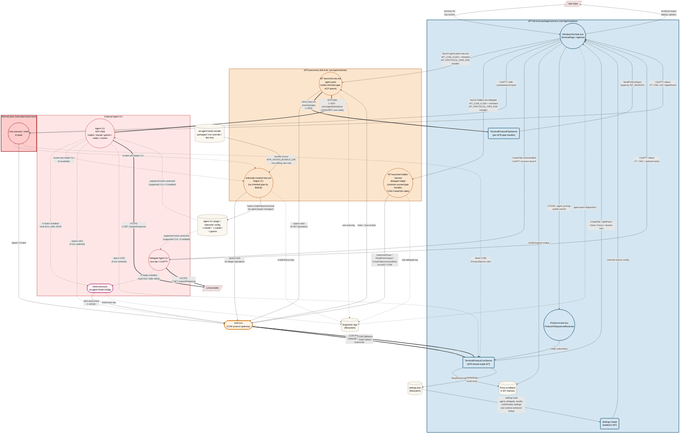

# Intelligent Terminal - Security Model & Threat Analysis

| Field | Value |
|---|---|
| **Document status** | Draft v1.2 |
| **Last updated** | 2026-05-12 |
| **Audience** | Microsoft internal security review |
| **Component** | Windows Terminal fork with embedded AI agents (WT + WTA + WTCLI) |

---

## 0. Review Scope and Security Boundary

This document reviews Intelligent Terminal against **application-level abuse by untrusted code running as the user**, especially code running inside a terminal pane or inside a semi-trusted Agent CLI. In scope are normal product surfaces and data flows: COM activation and method calls, `wtcli` / WTA helper commands, the `wt-agent-hooks` bridge, inherited environment variables, `settings.json`, diagnostic logs, VT / OSC output from pane processes, prompt injection, and Agent CLI behavior.

The inherited-pipe design is a **launch-time capability boundary**, not a same-user process isolation boundary. It is intended to prevent callers that only have COM access, environment-variable knowledge, process spawning ability, or ordinary child-process inheritance from invoking direct shell input. It does **not** claim to protect against same-user OS process-handle attacks such as opening WTA with `PROCESS_DUP_HANDLE`, duplicating WTA's pipe handle, or reading WTA process memory.

For this review, same-user OS process introspection and handle-table attacks against WTA are treated as out of scope. If reviewers require that capability to be in scope, the current inherited-pipe design is insufficient by itself; the mitigation would need OS-level isolation such as a restricted token, lower integrity, AppContainer/job isolation, tighter process DACLs, or a different IPC design with stronger client identity.

All residual-risk and mitigation statements below assume this boundary. If the boundary changes, the threat ratings and P0/P1 priorities must be revisited.

---

## 1. Executive Summary

Intelligent Terminal embeds AI agents into Windows Terminal. The security-sensitive capability is that agents can drive the user's terminal workflow: read pane output, create tabs or panes, and send input into shells.

The current model has two WT control planes:

1. **Terminal-scoped COM (`IProtocolServer`)** - used by `wtcli.exe`, WTA's fallback channel, and any direct COM client in an allowed activation context. This remains the main residual risk because it still exposes reads and several mutations.
2. **Per-WTA capability pipe** - an inherited anonymous pipe pair created by WT when it launches WTA. Direct shell input is routed here, not through COM.

Highest-priority residual risks:

| Risk | Why it matters | Current state |
|---|---|---|
| **Create/split over COM** | `CreateTab` / `SplitPane` can spawn attacker-chosen commands as WT children. | Still exposed through COM and stock `wtcli.exe`. |
| **Event broadcast disclosure** | Legacy `agent_event` envelopes are broadcast to every subscribed COM caller; a pane-context subscriber can passively observe other panes' agent prompts and tool calls. | No per-subscriber filtering; only observed platform COM activation behavior gates `Subscribe`. |
| **Prompt injection** | Capability transport proves that WTA is authorized; it does not prove the LLM's requested action is safe. | Confirmation settings exist in the settings model, but they default to `auto` and the current implementation does not enforce them on the runtime operation paths reviewed here. |
| **Hidden delegate pipe-handle hygiene** | `wta delegate` uses COM `CreateTab(commandline)` rather than `send_input`, but the hidden helper is launched through the same pipe-bearing WTA launcher. | Delegate mode currently receives unused pipe handles; startup cleanup and child-inheritance behavior need to be fixed or regression-tested. |
| **Autofix-triggered context disclosure** | Crafted OSC 133 failure marks can trigger automatic Autofix analysis that reads source-pane context and sends it to the Agent CLI / LLM before any fix-execution confirmation. | `autoFixEnabled` defaults to `true`; no first-run opt-in or analysis-time confirmation is implemented. |
| **Delegation context disclosure** | `wta delegate` / `?<prompt>` reads active-pane context and passes it to the delegate Agent CLI / LLM as startup prompt context. | No context-specific confirmation or redaction; the assembled delegate command line may also appear in process and diagnostic surfaces. |
| **Scrollback/log disclosure** | Pane output and diagnostic logs may contain secrets, source code, prompts, or command output. | Redaction is not implemented. |
| **Settings persistence via filesystem** | A process running as the user can overwrite `settings.json` and persistently change agent selection, Autofix behavior, or future AI policy knobs. | No meta-confirmation when WT reads policy-relevant settings and launches WTA / agent processes with those values. |

Key security claim under the §0 review boundary: shell input is capability-gated by inherited kernel handles (see §5.1 for the canonical statement and proof obligations). A caller with only terminal-scoped COM access cannot directly invoke `send_input`. This claim does not remove the remaining COM mutation surface.

---

## 2. System Overview

### 2.1 Components

| Component | Process | Identity / boundary notes |
|---|---|---|
| **WT** (`WindowsTerminal.exe`) | Long-lived UI host | Packaged desktop app running at medium integrity in the current configuration. Package-local paths are storage layout, not a low-privilege isolation boundary. |
| **WT-launched WTA** (`wta.exe`) | Agent-pane TUI or hidden delegate helper | Production intent is packaged and co-located with WT, but development / PATH fallbacks exist. Agent-pane WTA uses inherited pipe handles for `send_input`; hidden delegate WTA is also launched by WT but uses COM `CreateTab(commandline)` to start the delegate Agent CLI in a new tab. Binary resolution and identity are part of the trust boundary. |
| **WTA helper CLI** (`wta.exe`) | One-shot helper commands | Invoked by panes, agents, users, Settings UI, or support scripts. It normally has no inherited pipe handles and routes through COM / filesystem / third-party plugin managers depending on the subcommand. |
| **Agent-pane ACP Agent CLI / adapter** | `copilot`, `claude`, `gemini`, `codex`, custom; adapter packages launched through tools such as `npx` | Third-party child process spawned by agent-pane WTA and connected over ACP stdio. Treated as semi-trusted. It inherits normal process environment unless scrubbed, including `WT_COM_CLSID`, so a compromised Agent CLI or adapter can also attempt COM access. Claude/Codex ACP paths currently launch `npx -y` adapter packages, which adds package-manager supply-chain risk beyond local binary resolution. |
| **Delegate / in-pane Agent CLI** | Agent CLI launched in a WT / ConPTY pane, including delegate tabs created by `wta delegate` | Runs as a pane process, not as hidden delegate WTA's ACP stdio child. It can still inherit terminal metadata such as `WT_COM_CLSID`, emit VT / OSC output, and participate in hook bridges if that CLI supports hooks and hooks are installed. |
| **wt-agent-hooks bridge** | Agent CLI plugin/extension invoking `send-event.ps1` | Installed into Claude / Copilot / Gemini through their own plugin or extension managers. It wraps agent hook JSON and invokes `wtcli send-event`; it is an event/status bridge, not a shell-input capability. |
| **WTCLI** (`wtcli.exe`) | CLI client to WT protocol | Package-private binary. Observed WindowsApps / packaged-COM behavior denied direct launch or activation from ordinary external callers in local testing, but pane-launched processes can call COM directly. |
| **TerminalProtocolComServer** | COM server inside WT | Registered as a local server class; exposes reads and several mutations. |
| **TerminalProtocolPipeServer** | Per-WTA pipe server inside WT | Accepts only pipe methods such as `hello` and `send_input` today. |

### 2.2 Communication channels

| Channel | Endpoints | Transport | Security control today |
|---|---|---|---|
| **C-COM** | `wtcli` / direct COM caller <-> WT | COM `IProtocolServer` (`CLSCTX_LOCAL_SERVER`) | Observed Windows packaged-COM / terminal activation behavior before method execution. Local testing denied ordinary external callers and arbitrary same-package callers while allowing Intelligent Terminal pane children. This is a platform dependency, not an application-level authorization check implemented by `IProtocolServer`. `WT_COM_CLSID` is a branding-routing hint only, not a secret or gate. |
| **C-PIPE** | WTA <-> WT | Duplex anonymous-pipe pair (two one-way pipes), JSON-RPC over 4-byte little-endian frames | Launch-time inheritance and handle cleanup make the inherited kernel handle the capability. The numeric env vars are not capabilities. This does not defend against same-user handle duplication; see §5.1. |
| **C-ACP** | Agent-pane WTA <-> ACP Agent CLI | JSON-RPC over parent-created stdio pipes | No separate auth. The Agent CLI is intentionally trusted with its stdio handles and inherits normal environment unless WTA explicitly removes variables. |
| **C-HOOK** | Agent CLI hook bridge -> `wtcli` / COM -> WTA subscribers | Third-party CLI hook system launches `send-event.ps1`, which calls `wtcli send-event`; WTA receives events through `wtcli --json listen` / COM callbacks | Plugin-manager installation plus observed COM activation behavior. Hook payloads are untrusted and legacy `agent_event` broadcasts are not source-bound or subscriber-filtered today. This channel does not carry `send_input`. |
| **C-NET** | Agent CLI <-> LLM provider | HTTPS | Provider-managed auth/TLS; user data may leave the host. |
| **C-VT** | Shell <-> WT | ConPTY VT stream, including OSC marks | Not authenticated; pane output is attacker-controllable when the pane process is malicious. |
| **C-FS** | Processes <-> disk | `settings.json`, diagnostic logs, Agent CLI hook config / bundles | NTFS ACLs and package-local storage layout. This is not a sandbox boundary. |

### 2.3 Typical process tree

```text
WindowsTerminal.exe
+-- ConPTY -> user shell(s)
+-- ConPTY -> wta.exe agent pane
|   +-- Agent CLI (ACP stdio child)
+-- hidden wta.exe delegate helper process(es)
+-- ConPTY -> delegate Agent CLI tab(s)
```

Per `TerminalPage`, there is at most one persistent shared agent-pane WTA. Delegation can create short-lived hidden WTA helper processes; those helpers do not directly parent the delegate Agent CLI. They request WT to create a new tab with the delegate command line, so the delegate Agent CLI runs as a WT / ConPTY pane process.

### 2.4 Data-flow diagram



Reading the DFD: WT loads `settings.json` and uses those settings to choose WTA / Agent CLI launch behavior. WT-launched agent-pane WTA and hidden delegate WTA are the WTA shapes shown with inherited pipe handles: WT starts them with `WT_COM_CLSID` plus `WT_PROTOCOL_PIPE_R/W`. Only the agent-pane WTA directly parents an ACP Agent CLI and uses the inherited pipe for `send_input`. Hidden delegate WTA uses COM `CreateTab(commandline)` to ask WT to launch a delegate Agent CLI in a new ConPTY tab; that launch is not a `send_input` operation. The `externally invoked wta.exe helper CLI` node represents one-shot invocations from panes, agents, users, or Settings UI; those invocations do not receive the pipe unless some parent explicitly inherited the same handles. The bold capability path is therefore only `WT <-> WT-launched agent-pane WTA` for direct shell input. Normal pane output can feed scrollback and the protocol event bus through VT / OSC sequences. The practical pane attacker path is `InPane -> wtcli/direct COM -> WT state/scrollback/settings/topology`, and a compromised Agent CLI can reach the same COM path if it inherits `WT_COM_CLSID`. Hook events are optional and only exist for supported CLIs with hooks installed; they take a separate non-input path: `Agent CLI hook -> send-event.ps1 -> wtcli send-event -> COM SendEvent -> agent_event broadcast -> wtcli listen -> WTA listeners / subscribers`. Event disclosure flows through both `EventBus -> ComSrv -> COM callbacks` and hook-originated `SendEvent` broadcasts.

### 2.5 Control-plane split

| Method group | COM (`IProtocolServer`) | Stock `wtcli.exe` verb | Per-WTA pipe |
|---|---:|---:|---:|
| `Authenticate`†, `GetCapabilities` | yes | yes | `hello` only |
| `ListWindows/Tabs/Panes`, `ReadPaneOutput`, `GetActivePane`, `GetProcessStatus` | yes | yes | no |
| `GetSettings`, `GetSessionVariable` | yes | no current verb | no |
| `CreateTab`, `SplitPane`, `ClosePane`, `FocusPane`, events | yes | yes | no |
| `SetSessionVariable` | yes | no current verb | no |
| Direct shell input | no | no | yes |

† `Authenticate` is currently a no-op: it ignores its `token` argument and unconditionally sets `_authenticated = true`. See §6 row "COM caller spoofing".

This split is intentional only for shell input. The highest-risk remaining COM mutations are process creation through `CreateTab` and `SplitPane`. Other COM mutations remain in scope but have different impact: `ClosePane` is availability / data-loss risk, `FocusPane` is UI redress / focus manipulation, and `SetSessionVariable` is state spoofing / future-consumer risk because it writes pane-local in-memory variables and has no stock `wtcli.exe` verb today. `GetCapabilities()` should stay synchronized with the IDL and stock `wtcli.exe`; the previously stale `set_settings` advertisement is not present in the current implementation.

### 2.6 WTA helper CLI surface

WTA also exposes helper CLI commands for humans, agents, diagnostics, and Settings UI integration. The exact subcommand set is implementation detail; the security-relevant categories are:

| Category | Examples | Security-relevant behavior |
|---|---|---|
| WT operation helpers | `list-*`, `active-pane`, `capture-pane`, `pane-status`, `new-tab`, `split-pane`, `kill-pane`, `wait-for`, `listen` | Route reads, non-input mutations, and event subscription through `CliChannel` / `wtcli.exe` / COM. They do not create a separate trust boundary. |
| Delegation helper | `delegate` | Reads active-pane context, builds a delegate Agent CLI command line, then calls COM `CreateTab(commandline)` so WT launches the delegate Agent CLI in a new ConPTY tab. This is not a `send_input` primitive, but it is a pane-context disclosure and COM process-creation surface. |
| Hook-management helpers | `hooks install`, `hooks status`, `hooks uninstall` | Use third-party Agent CLI plugin / extension managers and filesystem state. They affect persistent hook configuration and do not use the inherited pipe. |
| Discovery / diagnostics helpers | `pipe-id`, `set-env` / `setenv`, `info`, `test-pipe` and legacy hidden flags | Expose or test WT protocol routing metadata such as `WT_COM_CLSID`. This metadata is not a bearer secret, but it helps a process locate the COM endpoint when observed platform activation behavior allows it. |

None of these helper categories grants a new authorization boundary. There is no public helper subcommand for direct shell input; the direct shell-input operation used by WTA runtime is `send_input`, and it is routed through the per-WTA inherited pipe only when WT launched that WTA with the pipe handles.

### 2.7 Agent hook bridge

`wt-agent-hooks` is a persistent event bridge for interactive Claude / Copilot / Gemini CLI sessions running in terminal panes. Installation is explicit through `wta hooks install`, the Settings UI install button, or the WTA setup flow; current code does not install hooks on every ordinary WTA startup. The installer resolves the static bundle from `WTA_HOOKS_BUNDLE_DIR`, the `wta.exe` sibling `wt-agent-hooks\` directory, or a development-tree fallback, then asks each CLI's own plugin / extension manager to install it.

For supported CLI sessions where hooks are installed, the third-party CLI hook system launches `send-event.ps1` for lifecycle, prompt, tool, notification, and error events. The script reads hook JSON from stdin, wraps it with `cli_source`, `agent_session_id`, and `payload`, then calls `wtcli send-event -e <event> -p %WT_SESSION% <json>`. WT receives that as COM `SendEvent`, normalizes it to legacy `agent_event`, and broadcasts it to all subscribers. WTA consumes the broadcast through `wtcli --json listen` and updates its `AgentSessionRegistry` / F2 Agents view. This path is useful telemetry and state synchronization; it is not an authorization path for shell input.

---

## 3. Trust Boundaries and Assets

### 3.1 Trust boundaries

| Boundary | Flows | Enforcement |
|---|---|---|
| **WT <-> pane shell** | ConPTY stdin/stdout | ConPTY process isolation. WT injects terminal metadata such as `WT_SESSION`, `WT_PROFILE_ID`, and sometimes `WT_COM_CLSID`. |
| **WT <-> WTA pipe** | `send_input` and future capability-gated methods | Inherited kernel handles. Numeric env vars alone are not capabilities; invalid fake handles fail during inherit-flag clearing or I/O, and a valid unrelated handle still does not connect to WT. This is a launch-time inheritance boundary, not protection against same-user `PROCESS_DUP_HANDLE` handle theft from WTA. |
| **Agent-pane WTA <-> ACP Agent CLI** | ACP stdio | Parent-created pipes. The Agent CLI is semi-trusted and inherits normal environment unless scrubbed; COM exposure from a compromised Agent CLI is therefore in scope. |
| **Agent CLI hook bridge** | Hook JSON -> `send-event.ps1` -> `wtcli send-event` -> COM `SendEvent` -> WTA event listener | Third-party CLI plugin / extension registration plus observed COM activation behavior. Hook payloads are untrusted input, can be spoofed by any COM-allowed sender today, and must not be treated as proof of agent identity or user approval. |
| **WT <-> COM callers** | `IProtocolServer` calls | Observed platform COM activation behavior. `IProtocolServer` itself does not implement meaningful caller authorization today; the practical allowed attacker context observed so far is a process launched inside an Intelligent Terminal pane. |
| **All <-> filesystem** | settings, logs, and Agent CLI hook configuration / bundles | NTFS ACLs. Package-local storage affects location, not privilege isolation. |

COM caller restriction in this document means the observed Windows packaged-COM activation behavior for the current package and registration, not a security decision made by `IProtocolServer` methods. Keep regression coverage for ordinary external callers, arbitrary same-package callers, pane children, and cross-integrity callers.

### 3.2 Assets

| Asset | Sensitivity | Notes |
|---|---|---|
| Shell stdin | Critical | Ability to execute commands as the user. |
| `settings.json` | Critical | Can change agent binaries, delegate behavior, Autofix behavior, and confirmation setting knobs. |
| Pane scrollback | Sensitive | May include secrets, command output, source, or copied file contents. |
| Process environment | Sensitive | May include customer secrets. `WT_COM_CLSID` itself is non-secret routing metadata. |
| Agent hook configuration / bundle | Sensitive | Persistent third-party CLI plugin or extension config under user-writable CLI directories, plus the `wt-agent-hooks` bundle resolved from packaged, env-override, or dev-tree locations. Controls what hook script future Agent CLI sessions execute. |
| Diagnostic logs | Sensitive | Known examples under `%LOCALAPPDATA%\IntelligentTerminal\logs\` include `wta-main.log`, `wta-delegate.log`, `wta-agent-pane.log`, `wta-install-hooks.log`, and `hook-trace.log`. Depending on operation and log level, diagnostic logs may include prompts, tool metadata, command lines, event payload summaries, errors, and model / agent output snippets. No systematic redaction or rotation is documented in the current implementation. |
| Inherited pipe handles | Sensitive | Possession grants per-WTA shell-input capability. |

---

## 4. Threat Actors

| Actor | Capability | Main goal |
|---|---|---|
| **In-pane process** | Runs as the user in a terminal pane; can read env, spawn processes, and use network. Observed local behavior allowed pane children to activate WT COM even without package identity. | Attack other panes, persist, or exfiltrate data. |
| **Prompt-injected LLM** | Can ask the semi-trusted Agent CLI/WTA to perform harmful actions. | Convert untrusted text into agent action. |
| **Compromised Agent CLI** | Runs as WTA child with normal user privileges, ACP stdio access, and inherited environment such as `WT_COM_CLSID` unless scrubbed. | Drive WT operations exposed to WTA or call COM directly. |
| **Hook bridge manipulator** | Controls Agent CLI plugin config, `WTA_HOOKS_BUNDLE_DIR`, a development-tree hook bundle, or `WTCLI_PATH` used by `send-event.ps1`. | Persist hook-script execution, spoof or suppress agent events, or exfiltrate hook payloads. |
| **WTA binary substitution / path hijack** | Controls a `wta.exe` resolved by development or PATH fallback before the intended packaged binary. | Receive inherited pipe handles and gain shell-input capability. |
| **Drive-by settings modifier** | Can write `settings.json` through the filesystem. | Persistently change future AI-session behavior. |

Out of scope: kernel exploits, compromise or replacement of the intended packaged / signed WT and WTA product binaries, intentional abuse by the interactive logged-in user, and physical access. In scope: untrusted code running as that user in a terminal pane, and product-controlled resolution or fallback paths that select an attacker-controlled WTA, Agent CLI, hook bundle, or `wtcli.exe`.

---

## 5. Key Data Paths

### 5.1 Shell input path

```text
LLM / Agent CLI
  -> WTA RoutedChannel
  -> inherited pipe JSON-RPC send_input
  -> TerminalProtocolPipeServer
  -> TerminalPage target lookup by WT_SESSION GUID
  -> TermControl / ControlCore
  -> ConPTY stdin
```

**Canonical capability statement.** Injecting keystrokes or commands into a shell pane (the `send_input` operation, which ultimately writes to ConPTY stdin) requires possession of the pipe handle that WT inherited to WTA at launch. The handle itself is the capability — no token, env var, identity check, or COM access substitutes for it. A process that does not hold the handle, and cannot duplicate it from WTA via same-user OS handle access, has no in-band path to this operation. The proof obligation is the table below; downstream sections refer back here rather than restating it.

| Step | Guarantee |
|---|---|
| WTA -> WT pipe | **Primary control:** kernel handle inheritance via `STARTUPINFOEX` + `PROC_THREAD_ATTRIBUTE_HANDLE_LIST` ensures only the launched WTA initially receives the handles. **Defense-in-depth in the agent-pane path:** `PipeChannel::from_env()` scrubs `WT_PROTOCOL_PIPE_R/W` and clears `HANDLE_FLAG_INHERIT` on WTA's copies before spawning the Agent CLI. Hidden delegate WTA is also launched with pipe handles but uses COM `CreateTab(commandline)` rather than `send_input`; it should either not receive those handles or claim/scrub them immediately, and child-process inheritance should be regression-tested. Only a process possessing the pipe handles can write valid frames. |
| Pipe method dispatch | Current allow-list accepts `hello` and `send_input`; unknown methods are rejected (`TerminalProtocolPipeServer.cpp:229,240`). |
| Target routing | `session_id` must parse as a non-empty GUID and match a pane by `Pane::FindPaneBySessionId`. There is no source-pane binding today; an authorized WTA can target any pane in the owning `TerminalPage` whose session GUID it knows. |
| Final write | `ControlCore` honors read-only mode before writing to the connection (`src/cascadia/TerminalControl/ControlCore.cpp`, `SendInput` / `_sendInputToConnection`). |

Non-guarantees: if the Agent CLI or LLM is prompt-injected and WTA is authorized, the pipe correctly carries the malicious request. Insert-only mode, rate limiting, prompt hygiene, and a future enforced confirmation layer must control that risk; the existing `aiIntegration.confirmation.*` settings are not a present enforcement control. Same-user duplication of WTA's pipe handles is a separate out-of-scope boundary condition under §0: if that boundary changes, the inherited-handle design no longer distinguishes the attacker from WTA.

### 5.2 Settings mutation path

```text
attacker-controlled user-context process (in-pane shell, Agent CLI, etc.)
  -> overwrite %LOCALAPPDATA%\...\settings.json
  -> future WT launch path reads weakened AI settings / attacker command
```

The mutation path is a direct filesystem write. This is not a new OS privilege — the attacker already runs as the user — but it can persistently change AI behavior without any in-band confirmation. Agent selection, custom agent commands, delegate behavior, Autofix, and future confirmation knobs are all policy-relevant even if some knobs are not enforced today. An Agent CLI (semi-trusted) and a pane-context process can both reach the file: `settings.json` lives at a well-known per-user path that any user-context process can discover via `%LOCALAPPDATA%` or by enumerating package data, so path knowledge is not a meaningful gate. The mitigation is therefore at the *read* side: WT's settings-load / agent-launch path must meta-confirm policy-relevant changes before honoring them, rather than relying on the file being write-protected.

### 5.3 Agent hook bridge path

Install path:

```text
Settings UI / WTA setup / wta hooks install
  -> agent_hooks_installer::ensure_installed()
  -> resolve wt-agent-hooks bundle
  -> Claude / Copilot plugin manager or Gemini extension manager
  -> persistent CLI hook registration
```

Runtime path:

```text
Supported Agent CLI hook fires in a pane, if hooks are installed
  -> send-event.ps1 reads hook JSON from stdin
  -> wraps cli_source, agent_session_id, payload
  -> wtcli send-event -e <agent.*> -p %WT_SESSION% <json>
  -> IProtocolServer::SendEvent
  -> TerminalProtocolComServer legacy agent_event broadcast
  -> wtcli --json listen subscribers
  -> WTA route_agent_event_to_registry()
```

This bridge is a state / telemetry path, not a shell-control authorization path. It improves WTA's ability to display live Agent CLI sessions, tool activity, and notifications, but the event payload is untrusted. Any caller that can reach COM `SendEvent` can currently publish the same legacy `agent_event` shape, so WTA must not treat hook events as proof of agent identity, user approval, or possession of the inherited pipe capability.

### 5.4 Delegation path

```text
user / command palette / wta helper
  -> wta delegate / ?<prompt>
  -> GetActivePane + ReadPaneOutput(active pane, 30 lines)
  -> append "## Terminal Context" to delegate prompt
  -> build delegate agent commandline
  -> COM CreateTab(commandline)
  -> WT / ConPTY launches delegate Agent CLI in a new tab
  -> delegate Agent CLI / LLM
```

Delegation is an agent-launch and context-transfer path, not a direct shell-input primitive. Current code enriches the delegate prompt with recent active-pane output when available, then builds a startup command line for the delegate Agent CLI. Hidden delegate WTA does not directly spawn that Agent CLI as an ACP stdio child; it asks WT over COM to create a new tab with the delegate command line. That means pane context can reach the delegate Agent CLI / LLM and may also appear in command-line inspection or diagnostic logging surfaces before any separate context-specific confirmation or redaction step. It also means this feature currently depends on the COM process-creation surface (`CreateTab`), not on the inherited-pipe `send_input` path.

---

## 6. Threat Table

| Threat | Category | Severity | Current control / gap |
|---|---|---:|---|
| COM caller spoofing | Spoofing | High | `Authenticate(token)` ignores its argument and unconditionally sets `_authenticated = true` (`TerminalProtocolComServer.cpp:268-288`). The `_authenticated` flag is not security-enforcing: only `Subscribe` (line 644) and `SendEvent` (line 663) even check it, and both are trivially passed by any caller that issues `Authenticate` first. No method is meaningfully gated by `_authenticated`. Observed platform COM activation behavior is the only currently effective gate, so it should be treated as a platform dependency rather than product authorization logic. |
| Event broadcast leaks cross-pane agent activity | Information disclosure | High | The legacy `agent_event` path calls `s_NotifyEventToComClients` (`TerminalProtocolComServer.cpp:698`; function body at line 174) and fans those envelopes out to every subscribed COM caller. A pane-context attacker that activates `IProtocolServer` and calls `Subscribe` can passively receive agent prompts and tool-call-style events across panes — no `ReadPaneOutput` invocation required. `autofix_state` and `agent_status` are direct-dispatch special cases, not broadcast on this path. No per-subscriber filtering today. |
| `CreateTab` / `SplitPane` arbitrary commandline | Tampering / app-boundary privilege expansion | High; Critical only if cross-integrity method access is ever allowed or the user accepts UAC elevation | Same-integrity WT gives same-user process creation and persistence. This is not OS privilege escalation in the normal non-elevated case. The delegate feature currently uses `CreateTab(commandline)` to launch delegate Agent CLI tabs, so migration must preserve explicitly authorized delegate launches without leaving arbitrary COM process creation exposed. Local testing observed `E_ACCESSDENIED` for medium-integrity callers requesting elevated WT `IProtocolServer`, but this should remain regression coverage rather than be treated as an application-level guarantee. |
| `ClosePane` over COM | Denial of service / data loss | Medium | A COM-allowed caller that knows or enumerates a pane session GUID can close that pane. This can disrupt work or lose unsaved terminal state, but it is not command execution and should not be grouped with `CreateTab` / `SplitPane` process creation. |
| `FocusPane` over COM | UI redress / spoofing | Medium | A COM-allowed caller can programmatically switch tabs, focus a pane, and influence where subsequent user keystrokes go. This is focus manipulation rather than direct shell input; it should be scoped or authorized separately from process-creation mutations. |
| `SetSessionVariable` over COM | Tampering / state spoofing | Low today; Medium if future trusted consumers depend on it | Writes pane-local in-memory session variables and removes them when the value is empty. Stock `wtcli.exe` has no current verb for this method. The present risk is state integrity and future-trust confusion, not arbitrary command execution. |
| `ReadPaneOutput` over COM | Information disclosure | High | Returns arbitrary scrollback; no redaction. |
| `GetSettings` / topology reads | Information disclosure | Medium | Reveals settings, cwd, pids, pane and tab topology. |
| COM DoS | Denial of service | Medium | No per-method rate limit; tab/pane churn can exhaust user-visible resources. |
| Pipe handle leakage to grandchildren | Spoofing / EoP | High | **Primary control:** `PROC_THREAD_ATTRIBUTE_HANDLE_LIST` confines inheritance to the WTA-side handles. **Agent-pane defense-in-depth:** WTA's pipe channel strips `WT_PROTOCOL_PIPE_R/W` and clears `HANDLE_FLAG_INHERIT` before spawning the Agent CLI. **Delegate-path gap:** hidden delegate WTA is launched with the same pipe env vars / handles but its `delegate` mode uses `CliChannel` / `wtcli` and does not claim the pipe through `PipeChannel::from_env()` today. That path should be changed to launch without pipe handles or to scrub them immediately, and helper child environments / handle inheritance should be regression-tested rather than assumed safe. |
| Fake pipe handle env vars | Spoofing | Medium | Env vars are not capabilities. Fake or unrelated numeric handles do not connect to WT and fail during handle setup or I/O. |
| Oversized or malformed pipe frames | Tampering / DoS | Low | Both sides use 4-byte length frames with a 64 KiB cap. |
| Prompt-injected Agent CLI action | Tampering | High | Transport auth cannot solve this. `aiIntegration.confirmation.{read,create,input}Operations` exist in the settings model and default to `auto`, but the current implementation does not enforce them on the runtime operation paths reviewed here; they should not be counted as an implemented mitigation. |
| Malicious Agent CLI or ACP adapter | Supply chain / EoP | Medium | Built-in agent IDs can resolve through PATH / known locations; custom commands are explicit but not identity-pinned. Claude/Codex ACP mode currently launches adapter packages through `npx -y`, so a package-manager resolution, download, cache, or version-substitution issue can execute code in the Agent CLI trust position even when the local agent binary is expected. The Agent CLI / adapter may inherit `WT_COM_CLSID`, so compromise can reach COM directly even if pipe env vars are scrubbed. |
| Hook event spoofing / registry poisoning | Spoofing / Tampering | Medium | `wtcli send-event` builds a legacy `agent_event` envelope, and `TerminalProtocolComServer::SendEvent` broadcasts it after only observed COM activation behavior plus no-op `Authenticate`. WTA updates its AgentSessionRegistry / F2 Agents view from those events without cryptographic source binding. This does not grant `send_input`, but can mislead attribution, live-session state, and user decisions. |
| Hook bridge bundle or path substitution | Supply chain / Tampering | Medium; High if untrusted bundle override is reachable in production | `wta hooks install` resolves bundle content from `WTA_HOOKS_BUNDLE_DIR`, an exe-sibling packaged directory, or a dev-tree fallback. `send-event.ps1` resolves `wtcli.exe` from PATH, `WTCLI_PATH`, then package install location. A controlled bundle or `wtcli` path can persist code execution in future Agent CLI hook contexts and exfiltrate hook payloads. |
| WTA binary substitution | Supply chain / EoP | High | Production intent is co-located packaged `wta.exe`, but `_DetectWtaPath()` also supports local dev and PATH fallbacks. Any resolved WTA binary receives the inherited pipe capability. |
| Diagnostic logs may disclose sensitive data | Information disclosure | Medium | WTA and hook logs may contain prompts, tool metadata, event payload summaries, command lines, errors, and model / agent output snippets depending on operation and log level. Known examples include `wta-main.log`, `wta-delegate.log`, `wta-agent-pane.log`, `wta-install-hooks.log`, and `hook-trace.log`. No systematic redaction or rotation is documented in the current implementation. |
| Direct `settings.json` file write | Tampering | Critical for persistent AI-policy bypass; not OS privilege escalation | Inherits filesystem ACL behavior; no meta-confirmation for policy changes before WT honors the changed settings in future WTA / agent launches. |
| Crafted OSC marks for Autofix | Information disclosure / Prompt injection / Tampering | High | OSC 133 is shell-controlled. With `autoFixEnabled=true` by default, a crafted failure mark can trigger WTA's Autofix analysis path to submit an agent prompt and read source-pane context via `wt_read_last_prompt` / `wt_read_pane_output` before any fix-execution confirmation. User interaction still gates applying a suggested fix, but pane-context disclosure and prompt-injection exposure can happen during analysis. |
| Delegation context disclosure | Information disclosure / Prompt injection | High | `wta delegate` / `?<prompt>` reads the active pane's recent output (`ReadPaneOutput(..., 30)`) and appends it as terminal context to the delegate prompt. It then uses COM `CreateTab(commandline)` to have WT launch the delegate Agent CLI in a new tab, not `send_input`. Sensitive pane data can be disclosed to the Agent CLI / LLM and exposed through command-line or diagnostic surfaces without a separate context confirmation. |

### Scope boundary note

Same-user OS process introspection and handle-table attacks against WTA, including `PROCESS_DUP_HANDLE` duplication of WTA's pipe handles, are intentionally outside the current review scope. They are therefore not rated as in-scope threats or present residual risks in this table. If reviewers reopen that boundary, the inherited-pipe design must be treated as insufficient by itself and the mitigation plan must be reprioritized around OS-level isolation or a different IPC design.

### Notes on elevation

`CreateTab` / `SplitPane` impact varies by WT integrity context:

| Scenario | Impact |
|---|---|
| Normal non-elevated WT | Same-user process creation, persistence, and detection evasion. Not a privilege gain. |
| Attacker already inside elevated WT pane | Additional admin child process creation. This is admin-level persistence, not a new elevation because the caller is already admin. |
| Medium-integrity external caller to elevated WT | Local testing observed `IProtocolServer` activation returning `E_ACCESSDENIED`; keep as regression coverage because WT does not set an explicit `CoInitializeSecurity` descriptor. |
| Elevated profile selected | User-assisted elevation if the attacker can trigger a UAC-backed elevated profile and the user approves. |

### Note on `PROC_THREAD_ATTRIBUTE_HANDLE_LIST`

When `bInheritHandles=TRUE` is used with `PROC_THREAD_ATTRIBUTE_HANDLE_LIST`, inheritance is constrained to the listed handles. This is safer than `bInheritHandles=TRUE` without an explicit handle list; it is not safer than inheriting no handles at all.

---

## 7. Mitigations

| Mitigation | Status | Covers |
|---|---|---|
| Move direct shell input off COM and into the per-WTA inherited pipe | Implemented | Direct keystroke injection by COM/`wtcli` callers |
| Migrate process-creation mutations (`CreateTab`, `SplitPane`) to per-WTA capability gating or add equivalent caller restriction | Planned | Main COM process-creation residual risk; delegate launch must move with this path rather than relying on arbitrary COM `CreateTab` |
| Scope or authorize lower-impact COM mutations (`ClosePane`, `FocusPane`, `SetSessionVariable`) by source/target pane or explicit caller policy | Planned | Pane DoS, UI redress, and session-variable state spoofing |
| Add per-subscriber filtering / authorization for `Subscribe` + `SendEvent` so a pane-context COM subscriber cannot observe other panes' agent events | Roadmap | Event broadcast disclosure |
| Keep `GetCapabilities()` synchronized with IDL and stock `wtcli.exe` | Current implementation matches reviewed COM surface | Review accuracy; prevents clients from relying on non-existent or stale methods |
| Implement runtime confirmation enforcement for sensitive read/create/input operation classes | Not implemented; settings-model knobs exist but are not wired to runtime authorization | Prompt injection, settings persistence |
| After enforcement exists, default `aiIntegration.confirmation.{read,create,input}Operations` to `prompt` on fresh install (all three currently default to `auto` per `MTSMSettings.h`) | Not implemented | Prompt-injection blast radius |
| Strip `WT_PROTOCOL_PIPE_R/W` env vars and clear `HANDLE_FLAG_INHERIT` immediately in WT-launched WTA | Partial — implemented when `PipeChannel::from_env()` runs in the agent-pane path; hidden delegate WTA currently receives unused pipe handles and needs launch-time removal or delegate-mode cleanup plus regression coverage | Grandchild handle leakage |
| Scrub `WT_COM_CLSID` from Agent CLI environment or restrict COM independently | Planned | Compromised Agent CLI direct COM access |
| Treat hook-originated `agent_event` as untrusted and add source binding / pane scoping before updating WTA session state | Roadmap | Hook event spoofing and registry poisoning |
| Pin the hook bundle and hook-side `wtcli.exe` resolution to packaged locations in production; gate `WTA_HOOKS_BUNDLE_DIR`, dev-tree, and `WTCLI_PATH` overrides behind debug or explicit consent | Planned | Hook bridge supply chain / path substitution |
| Length-framed pipe protocol with 64 KiB cap | Implemented | Pipe parser and memory DoS |
| Structured audit logging with WTA pid, source pane, target pane, and action type | Partial | Repudiation and incident response |
| Redact secrets in scrollback context and diagnostic logs | Roadmap | Exfiltration to LLM/log files |
| Insert-only mode for shell input recommendations | Partial | Reduces accidental execution; not universal for all `send_input` calls |
| Per-turn rate limit for shell-input calls | Roadmap | Agent runaway / prompt-injection loops |
| Pin or verify built-in Agent CLI binary identity and ACP adapter provenance | Partial — known-location / PATH resolution only; no signature pinning; `npx` adapter package versions / sources are not pinned or vendored | Agent CLI and adapter supply chain |
| Pin or verify WTA binary identity and remove PATH fallback from production launches | Planned | WTA binary substitution |
| Autofix opt-in / first-run hardening | Not implemented; `autoFixEnabled` defaults to `true` | Automatic pane-context disclosure, surprise background analysis, and prompt-injection exposure |
| Delegation context confirmation and prompt transport hardening | Not implemented; delegate prompt is enriched with recent active-pane output and launched through startup command line | Pane-context disclosure to delegate Agent CLI / LLM and command-line/log surfaces |

---

## 8. Residual Risks

1. **Terminal-scoped COM surface.** Until process-creation mutations move off COM or receive equivalent authorization, a pane-context COM caller can spawn WT child processes, read sensitive state, close or focus panes, spoof pane-local variables, and subscribe to cross-pane agent events.
2. **Prompt and context disclosure.** The inherited pipe proves WTA has the shell-input capability; it does not prove an LLM request is safe. Autofix, delegation, `ReadPaneOutput`, and diagnostic logs can move pane content, prompts, command lines, event payloads, or model output to Agent CLI / LLM / filesystem surfaces without redaction today.
3. **Hidden delegate pipe-handle hygiene.** Hidden delegate WTA currently launches through the same pipe-bearing WTA launcher even though delegate work uses COM `CreateTab(commandline)`. It should launch without those handles or scrub them at startup; helper child environment and handle inheritance need explicit regression coverage.
4. **Persistent filesystem trust.** Any user-context process can overwrite `settings.json`, and hook installation persists third-party CLI config outside WT. Policy-relevant settings, hook bundles, hook-side `wtcli.exe`, Agent CLI binaries, ACP adapters, and WTA fallback paths all need production-grade provenance or consent checks.
5. **Platform-dependent COM security.** Cross-integrity COM behavior should be regression-tested with the real `IProtocolServer` IID or a harmless method such as `GetCapabilities`; `IUnknown`-only activation is not sufficient evidence.

> Regression-test scope: WTA handle hygiene must cover every WT-launched WTA mode. Add tests that assert `WT_PROTOCOL_PIPE_R/W` are unset in Agent CLI / helper child environments and that the `HANDLE_FLAG_INHERIT` bit is cleared on WTA's copies before any child spawn. The hidden delegate path should either launch without pipe handles or scrub them even though delegate launch uses COM `CreateTab(commandline)`, not `send_input`.

---

## 9. Hardening Roadmap

| Priority | Item |
|---|---|
| **P0** | Move `CreateTab` and `SplitPane` behind per-WTA capability gating or equivalent explicit authorization, including the `wta delegate` launch path that currently depends on COM `CreateTab(commandline)`. |
| **P0** | Stop passing inherited pipe handles to hidden delegate WTA, or make delegate mode claim and scrub `WT_PROTOCOL_PIPE_R/W`, then regression-test helper child env vars and handle inheritance. |
| **P0** | Add per-subscriber filtering / authorization to `Subscribe` + `SendEvent` so a pane-context COM subscriber cannot passively observe other panes' agent events. |
| **P0** | Implement runtime confirmation enforcement for read/create/input operation classes before treating `aiIntegration.confirmation.*` as a mitigation. |
| **P0** | After enforcement exists, change fresh-install confirmation defaults from `auto` to `prompt`. |
| **P1** | Add meta-confirmation for changes to `aiIntegration.confirmation.*`, Autofix, and agent command settings in the WT settings-load / agent-launch path. |
| **P1** | Scrub `WT_COM_CLSID` from Agent CLI child environments, or make COM authorization independent of inherited pane environment. |
| **P1** | Add structured audit logging and log rotation. |
| **P1** | Add redaction for pane context and diagnostic logs. |
| **P1** | Source-bind or otherwise authenticate hook-originated `agent_event` before WTA updates AgentSessionRegistry state. |
| **P1** | Add per-turn shell-input rate limiting. |
| **P1** | Add source-pane / target-pane authorization for pipe `send_input`, or explicitly document that WTA may target any pane by session GUID. |
| **P1** | Scope or authorize lower-impact COM mutations (`ClosePane`, `FocusPane`, `SetSessionVariable`) separately from process creation. |
| **P1** | Autofix opt-in / first-run hardening — change `autoFixEnabled` default to `false` (or surface an analysis-time prompt) so pane context is not sent to the Agent CLI / LLM by surprise. |
| **P1** | Add delegation context confirmation/redaction and avoid putting full pane context into delegate command lines or diagnostic logs. |
| **P2** | Migrate read methods (`ReadPaneOutput`, `GetSettings`, topology reads) after mutation methods. |
| **P2** | Tighten built-in Agent CLI resolution and binary identity checks, and pin/vendor/verify ACP adapter packages launched through package managers such as `npx -y`. |
| **P2** | Tighten hook bundle and hook-side `wtcli.exe` resolution: packaged bundle by default, explicit consent for `WTA_HOOKS_BUNDLE_DIR` / dev-tree / `WTCLI_PATH` overrides. |
| **P2** | Tighten WTA resolution: prefer co-located packaged WTA only in production and gate dev / PATH fallback behind debug settings. |
| **P3** | Consider explicit COM security descriptor / caller allow-list once legitimate callers are reduced. |

---

## 10. Open Questions

1. Should WT or helper processes run with a more restricted token or lower integrity level as defense in depth?
2. Should `WTA` specifically run at a lower integrity level than the user — given it brokers shell input on behalf of a semi-trusted Agent CLI — even though same-user handle-table attacks are out of scope?
3. Can WT/WTA scrub `WT_COM_CLSID` from Agent CLI children without breaking legitimate agent tooling?
4. Should hook installation remain explicit, and should hook bundle / `WTCLI_PATH` overrides be disabled in production builds?
5. Can Agent CLI, ACP adapter package, and WTA binary identity be verified without breaking user-installed CLI workflows?
6. Are diagnostic logs ever collected by telemetry or support tooling? If yes, redaction becomes mandatory rather than best effort.
7. Should `settings.json` ACLs be tightened beyond inherited per-user filesystem defaults?

---

## 11. References

- `src/cascadia/TerminalApp/WtaProcessLauncher.{h,cpp}` - pipe creation and WTA launch
- `src/cascadia/TerminalApp/TerminalProtocolPipeServer.{h,cpp}` - inherited-pipe JSON-RPC server
- `src/cascadia/TerminalConnection/ConptyConnection.{h,cpp}` - agent-pane WTA launch with inherited handles
- `src/cascadia/WindowsTerminal/TerminalProtocolComServer.{h,cpp}` - COM surface
- `src/cascadia/TerminalProtocol/TerminalProtocol.idl` - protocol interface
- `wta/src/shell/wt_channel/pipe_channel.rs` - WTA inherited-pipe client
- `wta/src/shell/wt_channel/routed_channel.rs` - pipe-vs-COM method routing
- `wta/src/shell/wt_channel/cli_channel.rs` - `wtcli` fallback transport
- `wta/src/main.rs`, `wta/src/coordinator.rs` - delegation context collection and delegate command-line construction
- `wta/src/agent_registry.rs`, `wta/src/protocol/acp/client.rs` - Agent CLI / ACP adapter command construction and launch
- `wta/src/agent_hooks_installer.rs` - `wt-agent-hooks` install / status / uninstall logic
- `wta/wt-agent-hooks/` - Agent CLI hook bridge bundle and `send-event.ps1`
- `wta/src/app.rs`, `wta/src/agent_sessions.rs` - hook event routing into WTA session state
- `src/tools/wtcli/main.cpp` - CLI surface
- STRIDE methodology
