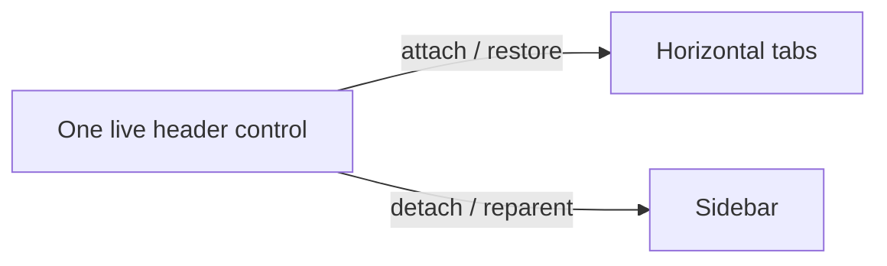
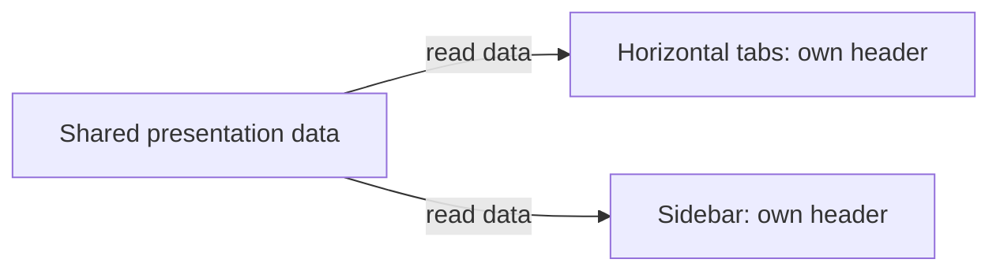

# Agent History and Sidebar Keyboard Navigation

## Status and scope

This specification defines the agreed target behavior, including the October 7,
2026 PM/UX revision. The single-scroll layout and one-time Sidebar introduction
supersede the earlier split-scroll/divider design and are being implemented.
This is not an acceptance report: build-specific results and remaining validation
belong in the release checklist and validation evidence.

The scenarios below cover the left sidebar in the **vertical** tab layout. The
sidebar and the independent **Agent Pane** are different surfaces. The **Agents**
surface combines open agent tabs above **Recent Sessions**; **History** below
refers to the existing view lifecycle, search, and focus state, not a page that
replaces the tab list. The one-time upgrade described below changes the initial
`tabLayout`; subsequent user choices, horizontal agent-session behavior, and
other agent/delegation shortcuts remain supported.

Native CLI launch identities remain paired with their original launch commands
when hooks report activity from another provider, including nested agents.
Activity/session bindings still rebind without overwriting persisted launch
metadata for either built-in or custom providers.

## One-time Sidebar upgrade and introduction

- Sidebar becomes the default tab layout for new users. On the first eligible
  upgrade, existing non-Sidebar users also move to Sidebar once.
- Persist a hidden migration-completed state separately from the hidden
  introduction-shown state. Neither appears as an editable Settings UI option.
  Migration completion is recorded only after its required layout change has
  succeeded through the existing settings persistence path.
- Later choosing horizontal tabs must not reset either state. Restarting,
  reloading settings, opening another window, or another ordinary upgrade must
  not force Sidebar again or repeat an already-shown introduction.
- Present a succinct, dismissible Windows TeachingTip anchored to the visible
  Sidebar only when its UI is ready. Explain the new tab organization, where to
  adjust the view, and how to return to horizontal tabs.
- Record introduction-shown state when the tip is actually presented, not
  merely when migration starts. If no usable anchor is available, defer the
  introduction without repeating the completed layout migration.
- Multiple windows must not independently repeat the same migration or bubble.
  Preserve existing onboarding, focus, and modal behavior.

| Default shortcut | Responsibility |
|---|---|
| `Ctrl+Shift+/` | Show/hide **Agents** in the sidebar (the History view lifecycle below), preserving whether shared search is open. |
| `Ctrl+Shift+S` | Enter the sidebar through **Search tabs**, or collapse it and return to the previous input when focus is already inside. |
| `Ctrl+Shift+.` | Show/hide the independent Agent Pane; its behavior is unchanged. |

In horizontal layout, `Ctrl+Shift+S` remains a consumed no-op: no layout/chrome
change and no input leakage into the terminal. User bindings can override or
unbind the defaults.

## Scenario matrix

The two focus policies referenced here are defined separately below.

| State before the action | Action | Resulting surface/state | Focus policy |
|---|---|---|---|
| Sidebar collapsed | `Ctrl+Shift+S` | Expand the sidebar and open **Search tabs**. | Remember the current terminal or Agent input, then focus the tab-search box. |
| Sidebar expanded, focus outside the sidebar | `Ctrl+Shift+S` | Keep the sidebar expanded and open **Search tabs**. | Remember the current input, then focus the tab-search box. |
| Sidebar expanded, focus inside the sidebar | `Ctrl+Shift+S` | Collapse the sidebar and close tab search or History. | Best-effort return to the input used before entering the sidebar; fall back to a visible terminal. |
| Sidebar expanded, History hidden | `Ctrl+Shift+/` or the Tabs header | Show the combined Agents surface; remember that the sidebar was expanded. | Remember focused tab search or the source input. Focus shared search only if it was already open; never activate it as a side effect of navigation. |
| Sidebar collapsed, History hidden | `Ctrl+Shift+/` | Expand the sidebar and show Agents; remember that the sidebar was originally collapsed. | Remember the source input and preserve search state; navigation alone does not open search. |
| Agents visible; sidebar was collapsed before History opened | `Ctrl+Shift+/` or the Agents header toggle | Return to Tabs **and collapse the sidebar**. | History source-restoration policy. |
| Agents visible; sidebar was expanded before History opened | `Ctrl+Shift+/` or the Agents header toggle | Return to Tabs; **keep the sidebar expanded**, with its ordinary tab list and no history section. | History source-restoration policy. |
| Sidebar expanded with History visible and focus inside | `Ctrl+Shift+S` | Collapse the whole sidebar and hide History. | Use the sidebar-hotkey entry input if still available, not History's saved entry state. |
| Sidebar expanded with History visible and focus outside | `Ctrl+Shift+S` | Hide History, keep the sidebar expanded, and open **Search tabs**. | Remember the current input, then focus tab search. |

The History close shortcut and Agents header toggle have the same close
behavior. The Tabs header opens Agents when the sidebar is expanded; it does
not expand a collapsed sidebar. By contrast, `Ctrl+Shift+S` intentionally opens
and focuses ordinary tab search on entry.

## Combined Agents surface

- The toolbar header toggles **Tabs** and **Agents** (reversible via header button
  or shortcut). A persistent swap icon and button border make the switch
  discoverable; normal button hover, pressed, and keyboard-focus feedback remain.
  Its tooltip and accessible action name say **Switch to Agents** in Tabs and
  **Switch to Tabs** in Agents. It performs one immediate switch, not dropdown
  navigation. There is no separate redundant Agents icon in the toolbar.
- The display-options button uses **Sidebar display options** for its tooltip
  and accessible name in both modes. Its menu configures visible tab details and
  any available tab filters; opening it does not itself filter tabs.
- History rows use a leading 16px provider icon, vertically centered across the
  title and metadata rows, with both text rows aligned to its right. Metadata is
  ordered as timestamp, meaningful status, and provider display name.
  Ended/historical rows omit the redundant
  Historical status; live Idle/Working/Attention/Error statuses remain visible.
  An outlined window with an upward restore arrow after the provider name
  identifies a confirmed background tab; clicking restores the whole original
  tab. Two overlapping windows identify a session attached to another visible
  window; clicking focuses its original tab and pane. The status remains plain
  activity text. Kept-tab membership takes precedence over an old window ID.
  Unknown ownership leaves the activity status visible without either indicator.
  Enter uses the same activation: focus or restore an existing bound pane, or
  attempt supported resume in the current window for an explicitly activated
  known-provider shell session with no bound pane. A failed bound-pane focus
  never falls back to creating a new resumed session.
  Bare Enter activates the focused History row even with selection disabled;
  modified Enter is ignored. A focused ownership button retains its native
  activation, rather than also activating its containing row.
  Provider identity remains available through the icon tooltip, highlighted
  provider-name text, and shared search.
  Time and provider text share bounded metadata space and may truncate with an ellipsis at the
  minimum sidebar width; status and the ownership action retain reserved space.
- History ages use Windows ICU's standard, locale-aware **short numeric relative
  time** format (CLDR), using the UI resource language rather than private unit
  abbreviations. For example, English uses `2 min. ago`, `2 hr. ago`, `2 wk. ago`,
  `2 mo. ago`, and `2 yr. ago`; translations and grammar come from the platform.
  Below a minute, the existing localized “just now” text remains. Whole elapsed
  minutes, hours, days, and seven-day weeks are floored; older timestamps use
  completed Gregorian UTC calendar months and years, including month-end and
  leap-year adjustment, rather than fixed 30-day/365-day approximations.
  Missing or unsupported timestamps, or timestamps that cannot be formatted, retain localized “unknown.”
  ICU's normal locale fallback applies, including for unsupported pseudo-locales.
- The Agents view has exactly one vertical scrolling viewport containing the
  live/open agent tabs followed immediately by **Recent Sessions**.
  The live section grows or shrinks with its tab, group, and pane rows; this does
  not mean stretching individual row heights. Recent Sessions follows the last
  live row rather than being pinned to the bottom edge of the window.
- There is no draggable divider, section-height setting, keyboard section
  resizing, fixed split ratio, or independent section scrollbar. Window resizing
  changes the shared viewport while both sections remain reachable.
  A theme-aware, noninteractive separator remains above the Recent Sessions
  heading in both expanded and collapsed states.
- Recent Sessions has a keyboard-accessible expand/collapse heading exposing its
  expanded state to UI Automation. It is initially expanded, preserving the
  existing visible-session behavior. Expanded session rows have no additional
  indentation beyond their existing provider-icon and metadata alignment.
  Collapsing this section does not leave Agents, clear shared search, delete
  sessions, or close agent tabs. Its action tooltip says **Expand recent sessions**
  or **Collapse recent sessions**, matching the current expanded state.
  Expansion is not selection: the heading retains neutral theme styling rather
  than an accent-colored checked fill, with ordinary hover and pressed feedback.
  Its custom automation peer derives from `ToggleButtonAutomationPeer`, matching
  the heading's `ToggleButton` base. XAML requires that peer interface when
  `IsChecked` changes with UI Automation property listeners active, including
  during template realization.
- Preserve virtualized row realization, keyboard navigation, focused-row
  visibility, and existing live-tab/group/pane interactions with the shared
  scroll surface; do not obtain one scrollbar by introducing unbounded nested
  lists.
- **Unified Search**: There is no separate history search box. The single
  `SearchTextBox` in the sidebar filters both the upper live agent tabs and the
  lower history rows concurrently. Entering or leaving Agents does not discard
  an active search query or activate a search that was closed. The shared search
  action opens the box explicitly; selecting Agents does not imply searching.
- In Agents, the search placeholder, automation names, and button tooltip read
  **Search active and recent agent sessions**; Tabs retains **Search tabs**.
  Active includes idle open agent sessions, not only currently working agents.
  The header toggle
  is disabled while projection controls are blocked, in either direction.
- Recent Sessions retains its loading, error, and empty-state messages without
  replacing usable retained rows or introducing another scrolling viewport.
  Runtime Narrator/UIA and RTL behavior remain separate validation steps.
- Exclude only the represented history identity: provider, session ID, source
  location (host or WSL distro), and session universe. The open-pane binding
  supplies session ID, provider (when known), and pane ID; the matching history
  row supplies location and universe. Pane ID disambiguates colliding history
  identities, but an unambiguous session/provider remains represented after
  rebinding to a new pane even if its history row still names the old pane.
  A graceful connection close refreshes this projection even when the pane is
  retained by `closeOnExit: never`; a failed connection retains its binding until
  the pane closes.
  If colliding rows cannot be disambiguated, retain them rather than hiding
  an unrelated session. Status alone is not identity: an idle or working
  session without a representing open pane remains in the lower section.

## History: restore the entry state and input, best effort

When transitioning from Tabs to Agents, retain:

- Whether the sidebar was collapsed **before** any expansion needed to show
  History.
- The source input location: the Agent Pane chat input or the specific terminal
  pane, including its particular split.
- Whether ordinary tab search had keyboard focus, retaining its query.

Do not replace this entry context with the search box when focus moves
there. When Agents is closed by its shortcut or header toggle, restore the
remembered sidebar expanded/collapsed state and attempt to restore the source
input.

If History was opened from focused tab search and the rail remains expanded,
restore focus to that search box with its query intact. Otherwise:

1. If the source is still visible and focusable, return to that input location,
   preserving its unsent draft.
2. If the source has been collapsed, closed, or is otherwise unavailable, fall
   back to a visible, focusable terminal pane in the current tab.
3. If no suitable terminal target exists, retain any remaining valid focus and
   return without a user-facing error, blocking wait, or retry loop.

Do not expand a hidden Agent Pane, create a pane/tab, or resume a session merely
to recover focus.

**Important:** closing History that originally expanded a collapsed sidebar
also collapses the sidebar, but this is still a **History close**. It must use
History's remembered source, not the separate `Ctrl+Shift+S` entry input.

## Sidebar hotkey: enter search and return to input

`Ctrl+Shift+S` navigates between the current input and the sidebar's tab search.

- When the sidebar is collapsed, expand it, open ordinary **Search tabs**, and
  focus its search box. When expanded with focus outside, open/focus the same
  box without collapsing the sidebar.
- Remember the terminal or Agent chat input used just before this hotkey entry.
  A later entry from another input replaces that best-effort return target.
  Closing Search tabs with Escape or its button expires the target; opening
  Search tabs without the hotkey (including its pointer or keyboard button)
  starts without a saved hotkey source. A new hotkey entry captures its input
  only after search has opened successfully.
- When focus is inside the expanded sidebar, collapse it. If the remembered
  input remains visible and focusable, return there without changing its
  unsent draft. Otherwise, try the currently active visible terminal or Agent
  input, then a visible terminal pane in the current tab, best effort; never
  reopen a hidden Agent Pane or create a pane to recover focus.
- If no target exists, leave any remaining valid focus unchanged; do not
  display an error, block, or retry indefinitely.

The titlebar's Expand/Collapse button retains its existing visibility behavior;
it does not itself open tab search. `Ctrl+Shift+S` while History is visible
does not invoke History's source-restoration path. A subsequent History opening
captures its own new entry context.
The public `toggleSidebar` command remains a visibility toggle when invoked
from the command palette or another non-key source. The titlebar rail toggle
counts as inside the sidebar for the keybinding's focus policy.

## Data and lifecycle invariants

- These actions change visibility and focus only. They do not delete, clear, or
  modify underlying session records or conversation contents.
- They do not terminate agent processes/tasks, restart agents, or resume
  conversations for focus recovery.
- Preserve unsent chat and terminal input.
- History list refreshing and transient loading/error UI may follow the existing
  view-close lifecycle. Stopping a list refresh must not stop an agent task.
- Closing History does not mean closing the independent Agent Pane.
- Expected unavailable-focus cases are normal best-effort fallbacks, not reasons
  to display an error or leave keyboard interaction blocked.

## Sidebar toggle hint

- Use the localized labels **Expand sidebar** and **Collapse sidebar** for the
  tooltip and automation name, retaining the existing resource identifiers.

## Tab-header ownership and rename focus

### Presentation design principles

The problem with transferring a live header between layouts is that data,
visual ownership, edit state, and rendering lifetime become coupled. The
principle-led change is to share the information while each view keeps its
own controls:

1. **Share data, not controls.** Titles, status, rich metadata, and accessibility
   text have one shared source; Horizontal and Sidebar realizations own their
   own headers and icons.
2. **Change presentation, not meaning.** Layout-specific visibility does not
   change progress or pin state. Selection and commands follow stable tab/pane
   identity, not a temporary display index.
3. **Let the view own rendering lifetime.** The visible control owns its clock
   and reconciles actual attachment/visibility. Do not put clocks in shared
   models or add per-move animation repair callbacks.

**Before:** one live header is sequentially attached/restored or reparented.

**After:** the same information is read by independently owned views.

The benefit is stable visual ownership through moves/layout changes, correct
command/selection ownership, and locally managed animation lifetime. This is
a focused presentation boundary, not a full application architecture rewrite or a
reason to add speculative framework layers. The contracts below remain the
implementation reference.

The tab owns a data-only `TabHeaderPresentation` and the existing aggregate
`TerminalTabStatus`. The canonical horizontal `TabViewItem` permanently retains
its native `TabHeaderControl`. Each sidebar row template creates a separate
`TabHeaderControl` bound to the same presentation; no header control is extracted,
detached, or transferred during reorder or layout changes. Sidebar icon elements
are also template-owned, with retained `IconSource` data rather than shared live
elements. Pane rows and terminal/taskbar progress remain independent of this
presentation contract.

The localized tab accessibility name is computed once alongside pin and rich
metadata state, stored in the shared presentation, and projected to the native
tab and selectable sidebar row. The existing container-realization handler
installs a one-way binding to observable presentation data and clears it on
recycle. UWP does not evaluate bindings in style setters; the row does not bind
through a nested attached-property path on the hidden horizontal control.
The C++ presentation is marked `bindable` so runtime binding can resolve its
properties through generated XAML metadata; compiled `x:Bind` alone does not
provide that runtime lookup contract.

Selection is restored by canonical tab identity mapped to the current sidebar
descriptor, not by treating a canonical index as a display index. Existing
focus fallback first retains the current visible terminal or Agent input, then
uses the existing source-shell fallback; this adds no saved focus field,
selection cache, timer, repair callback or view-model clock.

Pin state remains shared model data. `TabHeaderControl.ShowPinnedIcon` is an
appended, view-local property, defaulting to true: the canonical horizontal
header sets it to false, while newly created sidebar headers retain the default.
Only the horizontal visual pin glyph is hidden. Sidebar badges, accessibility
labels, Pin/Unpin menus, ordering, first-ordinary unpin placement and cross-pin
movement boundaries retain #1052 semantics. This does not clear `IsPinned`,
restore original positions, introduce grouping UI or permit unrestricted
movement across pinned/unpinned boundaries. The primary layout round trip
verifies canonical owner and the sidebar selection pattern before secondary
visual checks. Matched same-profile title-leading offsets measure reserved pin
space; FontIcon peer counts are diagnostic only because UWP may not expose
those peers. Small compositor crops include the full header and leading glyphs.
Actual Sidebar pin presence and Horizontal pin absence require independent
visual review; neither geometry nor peer absence proves rendered pixels.

Indeterminate header, pane-row, and tab-switcher progress use the shared
`IndeterminateProgressRing` control and its style in
`IndeterminateProgressResources.xaml`. The control owns one compositor
rotation animation on its current template visual and starts it only while loaded, active, and visible through its
attached visual ancestry. Activity and ancestor-visibility callbacks stop or
start the clock; unload stops it and releases weak ancestry observers, and load
observes the new ancestry. Template replacement stops the old clock before
attaching to the replacement visual. This is view-local rendering lifetime, not progress
model state or per-move/layout repair; there is no XAML `Loaded` trigger or
native `ActiveStates` group or XAML storyboard target competing with it.

The rotation targets a renderer-owned child ShapeVisual, not the
framework-owned XAML element visual that recycling/layout can reset.
The control's `IsActive` property remains bound to status; the existing outer
active gate and inner indeterminate gate control presentation. It is neither a
keyboard tab stop nor a hit-test target, and its automation peer exposes
`ProgressBar` without a numeric `RangeValue` pattern. The arc uses
the resolved Foreground brush, including brush color and theme changes; MUX determinate/error/paused progress and the
shared data/identity policy are unchanged. Product-host reload/animation
acceptance still requires runtime integration validation.

Identity and progress are separate: a profile or known live agent icon remains
visible beside active progress in horizontal tabs, individual sidebar tabs,
and pane rows. In the expanded sidebar, a collapsible group's chevron occupies
the same leading slot as an individual tab's identity icon, without an
additional profile icon; their top-level title positions remain aligned whether
the group is expanded or collapsed. The compact rail hides the chevron and
retains identity. Explicit hidden-icon styling remains hidden, including while busy.
The sidebar uses the native tab's configured source, including monochrome
styling; the existing agent-session projection still selects the provider icon.
Selected-color contrast applies to monochrome identity, not colored bitmaps or
extracted images.

Metadata visibility and the aggregate-progress visibility gate belong to the
individual view. Title, search text, rename width, metadata text/accessibility
text, and aggregate status are shared data. A recycled view cancels an outstanding
rename before rebinding without committing it or requesting focus for its new
owner.

Context-menu and palette rename commands resolve the realized row header, as
does the color-picker anchor. Rename commits route through that row's current
canonical tab to `SetTabText`; rename completion uses the existing focus-request
path. Closing a context menu checks the real row's `InRename` before restoring
terminal focus.
Interactive requests reveal the actual row by closing History and expanding a
collapsed rail through the existing view commands. Filter-hidden rows remain
unavailable; no invisible native-header fallback is used.

Existing WinRT methods retain their ordering and signatures. New members are
appended. `TabStripDisplayItem.Header` retains its `Object` getter/setter slots,
but now returns `TabHeaderPresentation`, never a visual; its setter accepts
presentation data, a legacy header (extracting only its data), a boxed title,
or null (creating an empty presentation). `Icon` retains its `IconElement`
getter/setter slots on both tab and pane descriptors as a data-only compatibility
adapter, not a promise of full legacy visual semantics: the getter creates a fresh,
unparented native icon element, and the setter extracts source data from standard
icon types. Unsupported inputs fail with `E_INVALIDARG`. Templates use the
`Presentation` and validated, data-only `IconSource` properties instead. The
`Object` icon-source slot contains a MUX `IconSource`; this avoids the XAML
function-binding compiler default-constructing the abstract source base class.
The icon-source
factory creates a fresh element per template and retains EXE/DLL image sources,
agent SVG geometry, bitmap and symbol sources, and font/RTL properties.
Pane descriptors retain source data, content identity, and status, never live
icon elements. Tab and pane adapters share the same conversion and element
factory; simultaneous containers share geometry/image data but own distinct
elements.
- Show the label and dimmed effective shortcut on the same line with 8 units
  of spacing for both the collapsed **Expand sidebar** and expanded
  **Collapse sidebar** buttons. Keep Segoe UI Variable, `FontSize=12`, normal
  weight, `LineHeight=16`, and shortcut opacity `0.7`.
- Display normal shortcut casing, such as `Ctrl+Shift+S`, rather than serialized
  lowercase text.
- Resolve the effective sidebar binding and refresh the hint when settings
  change. Rebinding changes the displayed chord; unbinding or overriding the
  action hides the obsolete shortcut without leaving an empty gap.

Opening Search tabs with `Ctrl+Shift+S` does not change the separate
`Ctrl+Shift+/` History shortcut or the ordinary Tab traversal of sidebar items.

## Acceptance scenarios

These are required checks for this contract, not claims of completed validation:

- Exercise Agents open/close from both an initially expanded and an initially
  collapsed sidebar, using the shortcut and header toggle.
- Check that open agent tabs stay in the upper scrollable section and history
  stays in the lower scrollable section, separated by the draggable/keyboard-navigable
  splitter.
- Check that only identity-matched represented sessions are absent from history,
  and unattached idle sessions remain available.
- Check that entering search queries in the single sidebar search box filters
  both open agent tabs and history rows concurrently.
- For both entry states, verify restoration to Agent Pane chat and to the exact
  originating terminal split when each remains available.
- Repeat with an unavailable source and verify the visible-terminal fallback,
  unchanged session data/drafts, and nonblocking behavior.
- Verify that `Ctrl+Shift+S` from either collapsed or expanded/outside focus
  activates tab search and focuses its box; a second press from inside
  collapses and best-effort restores the originating shell or Agent input.
- Inspect both Expand/Collapse hints against the single-line designer
  reference, including the sidebar wording, accurate shortcut presence,
  casing, remapping, and unbinding.

The related release-checklist IDs remain `C110` (History), `C112` (action
dispatch), `C365` (sidebar toggle), and `C366` (hint presentation). Earlier
results for a different behavior contract are not acceptance of this revision.
