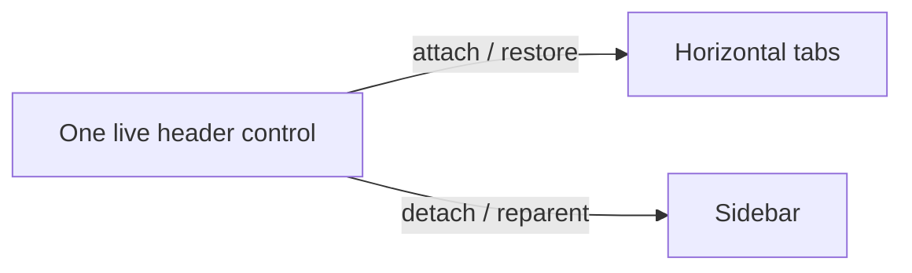
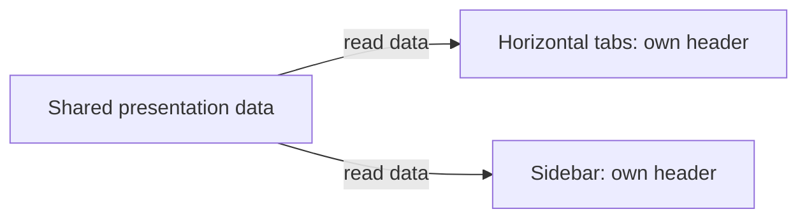

# Agent History and Sidebar Keyboard Navigation

## Status and scope

This specification defines the agreed behavior implemented by the sidebar keyboard
actions. It is not an acceptance report: build-specific results and remaining
validation belong in the release checklist and validation evidence.

The scenarios below cover the left sidebar in the **vertical** tab layout. The
sidebar and the independent **Agent Pane** are different surfaces. This contract
does not change `tabLayout`, horizontal agent-session behavior, or other
agent/delegation shortcuts.

| Default shortcut | Responsibility |
|---|---|
| `Ctrl+Shift+/` | Show/hide the Agent Session view in the sidebar, called **History** below. Opening History focuses its own search box. |
| `Ctrl+Shift+S` | Enter the sidebar through **Search tabs**, or collapse it and return to the previous input when focus is already inside. |
| `Ctrl+Shift+.` | Show/hide the independent Agent Pane; its behavior is unchanged. |

In horizontal layout, `Ctrl+Shift+S` remains a consumed no-op: no layout/chrome
change and no input leakage into the terminal. User bindings can override or
unbind the defaults.

## Scenario matrix

The two focus policies referenced here are defined separately below.

| State before the action | Action | Resulting surface/state | Focus policy |
|---|---|---|---|
| Sidebar collapsed | `Ctrl+Shift+S` | Expand the sidebar and open **Search tabs**. | Remember the current terminal or Agent input, then focus the tab-search box. |
| Sidebar expanded, focus outside the sidebar | `Ctrl+Shift+S` | Keep the sidebar expanded and open **Search tabs**. | Remember the current input, then focus the tab-search box. |
| Sidebar expanded, focus inside the sidebar | `Ctrl+Shift+S` | Collapse the sidebar and close tab search or History. | Best-effort return to the input used before entering the sidebar; fall back to a visible terminal. |
| Sidebar expanded, History hidden | `Ctrl+Shift+/` | Show History; remember that the sidebar was expanded. | Remember focused tab search or the source input, then focus the History search box. |
| Sidebar collapsed, History hidden | `Ctrl+Shift+/` | Expand the sidebar and show History; remember that the sidebar was originally collapsed. | Remember the source input, then focus the History search box. |
| History visible; sidebar was collapsed before History opened | `Ctrl+Shift+/` or the History close button | Hide History **and collapse the sidebar**. | History source-restoration policy. |
| History visible; sidebar was expanded before History opened | `Ctrl+Shift+/` or the History close button | Hide History; **keep the sidebar expanded**, displaying its ordinary page without History. | History source-restoration policy. |
| Sidebar expanded with History visible and focus inside | `Ctrl+Shift+S` | Collapse the whole sidebar and hide History. | Use the sidebar-hotkey entry input if still available, not History's saved entry state. |
| Sidebar expanded with History visible and focus outside | `Ctrl+Shift+S` | Hide History, keep the sidebar expanded, and open **Search tabs**. | Remember the current input, then focus tab search. |

The History close shortcut and close button have the same behavior. By contrast,
`Ctrl+Shift+S` intentionally opens and focuses ordinary tab search on entry.

## History: restore the entry state and input, best effort

When transitioning from hidden History to visible History, retain:

- Whether the sidebar was collapsed **before** any expansion needed to show
  History.
- The source input location: the Agent Pane chat input or the specific terminal
  pane, including its particular split.
- Whether ordinary tab search had keyboard focus, retaining its query.

Do not replace this entry context with the History search box when focus moves
there. When History is closed by its shortcut or close button, restore the
remembered sidebar expanded/collapsed state and attempt to restore the source
input.

If History was opened from focused tab search and the rail remains expanded,
restore focus to that search box with its query intact. Otherwise:

1. If the source is still visible and focusable, return to that input location,
   preserving its unsent draft.
2. If the source has been collapsed, closed, or is otherwise unavailable, fall
   back to a visible, focusable terminal pane in the current tab.
3. If no suitable terminal target exists, retain any remaining valid focus and
   return without a user-facing error, blocking wait, or retry loop.

Do not expand a hidden Agent Pane, create a pane/tab, or resume a session merely
to recover focus.

**Important:** closing History that originally expanded a collapsed sidebar
also collapses the sidebar, but this is still a **History close**. It must use
History's remembered source, not the separate `Ctrl+Shift+S` entry input.

## Sidebar hotkey: enter search and return to input

`Ctrl+Shift+S` navigates between the current input and the sidebar's tab search.

- When the sidebar is collapsed, expand it, open ordinary **Search tabs**, and
  focus its search box. When expanded with focus outside, open/focus the same
  box without collapsing the sidebar.
- Remember the terminal or Agent chat input used just before this hotkey entry.
  A later entry from another input replaces that best-effort return target.
  Closing Search tabs with Escape or its button expires the target; opening
  Search tabs without the hotkey (including its pointer or keyboard button)
  starts without a saved hotkey source. A new hotkey entry captures its input
  only after search has opened successfully.
- When focus is inside the expanded sidebar, collapse it. If the remembered
  input remains visible and focusable, return there without changing its
  unsent draft. Otherwise, try the currently active visible terminal or Agent
  input, then a visible terminal pane in the current tab, best effort; never
  reopen a hidden Agent Pane or create a pane to recover focus.
- If no target exists, leave any remaining valid focus unchanged; do not
  display an error, block, or retry indefinitely.

The titlebar's Expand/Collapse button retains its existing visibility behavior;
it does not itself open tab search. `Ctrl+Shift+S` while History is visible
does not invoke History's source-restoration path. A subsequent History opening
captures its own new entry context.
The public `toggleSidebar` command remains a visibility toggle when invoked
from the command palette or another non-key source. The titlebar rail toggle
counts as inside the sidebar for the keybinding's focus policy.

## Data and lifecycle invariants

- These actions change visibility and focus only. They do not delete, clear, or
  modify underlying session records or conversation contents.
- They do not terminate agent processes/tasks, restart agents, or resume
  conversations for focus recovery.
- Preserve unsent chat and terminal input.
- History list refreshing and transient loading/error UI may follow the existing
  view-close lifecycle. Stopping a list refresh must not stop an agent task.
- Closing History does not mean closing the independent Agent Pane.
- Expected unavailable-focus cases are normal best-effort fallbacks, not reasons
  to display an error or leave keyboard interaction blocked.

## Sidebar toggle hint

- Use the localized labels **Expand sidebar** and **Collapse sidebar** for the
  tooltip and automation name, retaining the existing resource identifiers.

## Tab-header ownership and rename focus

### Presentation design principles

The problem with transferring a live header between layouts is that data,
visual ownership, edit state, and rendering lifetime become coupled. The
principle-led change is to share the information while each view keeps its
own controls:

1. **Share data, not controls.** Titles, status, rich metadata, and accessibility
   text have one shared source; Horizontal and Sidebar realizations own their
   own headers and icons.
2. **Change presentation, not meaning.** Layout-specific visibility does not
   change progress or pin state. Selection and commands follow stable tab/pane
   identity, not a temporary display index.
3. **Let the view own rendering lifetime.** The visible control owns its clock
   and reconciles actual attachment/visibility. Do not put clocks in shared
   models or add per-move animation repair callbacks.

**Before:** one live header is sequentially attached/restored or reparented.

**After:** the same information is read by independently owned views.

The benefit is stable visual ownership through moves/layout changes, correct
command/selection ownership, and locally managed animation lifetime. This is
a focused presentation boundary, not a full application MVVM rewrite or a
reason to add speculative framework layers. The contracts below remain the
implementation reference.

The tab owns a data-only `TabHeaderPresentation` and the existing aggregate
`TerminalTabStatus`. The canonical horizontal `TabViewItem` permanently retains
its native `TabHeaderControl`. Each sidebar row template creates a separate
`TabHeaderControl` bound to the same presentation; no header control is extracted,
detached, or transferred during reorder or layout changes. Sidebar icon elements
are also template-owned, with retained `IconSource` data rather than shared live
elements. Pane rows and terminal/taskbar progress remain independent of this
presentation contract.

The localized tab accessibility name is computed once alongside pin and rich
metadata state, stored in the shared presentation, and projected to the native
tab and selectable sidebar row. The existing container-realization handler
installs a one-way binding to observable presentation data and clears it on
recycle. UWP does not evaluate bindings in style setters; the row does not bind
through a nested attached-property path on the hidden horizontal control.
The C++ presentation is marked `bindable` so runtime binding can resolve its
properties through generated XAML metadata; compiled `x:Bind` alone does not
provide that runtime lookup contract.

Selection is restored by canonical tab identity mapped to the current sidebar
descriptor, not by treating a canonical index as a display index. Existing
focus fallback first retains the current visible terminal or Agent input, then
uses the existing source-shell fallback; this adds no saved focus field,
selection cache, timer, repair callback or view-model clock.

Pin state remains shared model data. `TabHeaderControl.ShowPinnedIcon` is an
appended, view-local property, defaulting to true: the canonical horizontal
header sets it to false, while newly created sidebar headers retain the default.
Only the horizontal visual pin glyph is hidden. Sidebar badges, accessibility
labels, Pin/Unpin menus, ordering, first-ordinary unpin placement and cross-pin
movement boundaries retain #1052 semantics. This does not clear `IsPinned`,
restore original positions, introduce grouping UI or permit unrestricted
movement across pinned/unpinned boundaries. The primary layout round trip
verifies canonical owner and the sidebar selection pattern before secondary
visual checks. Matched same-profile title-leading offsets measure reserved pin
space; FontIcon peer counts are diagnostic only because UWP may not expose
those peers. Small compositor crops include the full header and leading glyphs.
Actual Sidebar pin presence and Horizontal pin absence require independent
visual review; neither geometry nor peer absence proves rendered pixels.

Indeterminate header, pane-row, and tab-switcher progress use the shared
`IndeterminateProgressRing` control and its style in
`IndeterminateProgressResources.xaml`. The control owns one compositor
rotation animation on its current template visual and starts it only while loaded, active, and visible through its
attached visual ancestry. Activity and ancestor-visibility callbacks stop or
start the clock; unload stops it and releases weak ancestry observers, and load
observes the new ancestry. Template replacement stops the old clock before
attaching to the replacement visual. This is view-local rendering lifetime, not progress
model state or per-move/layout repair; there is no XAML `Loaded` trigger or
native `ActiveStates` group or XAML storyboard target competing with it.

The rotation targets a renderer-owned child ShapeVisual, not the
framework-owned XAML element visual that recycling/layout can reset.
The control's `IsActive` property remains bound to status; the existing outer
active gate and inner indeterminate gate control presentation. It is neither a
keyboard tab stop nor a hit-test target, and its automation peer exposes
`ProgressBar` without a numeric `RangeValue` pattern. The arc uses
the resolved Foreground brush, including brush color and theme changes; MUX determinate/error/paused progress and the
shared data/identity policy are unchanged. Product-host reload/animation
acceptance still requires runtime integration validation.

Identity and progress are separate: a profile or known live agent icon remains
visible beside active progress in horizontal tabs, individual sidebar tabs,
and pane rows. In the expanded sidebar, a collapsible group's chevron occupies
the same leading slot as an individual tab's identity icon, without an
additional profile icon; their top-level title positions remain aligned whether
the group is expanded or collapsed. The compact rail hides the chevron and
retains identity. Explicit hidden-icon styling remains hidden, including while busy.
The sidebar uses the native tab's configured source, including monochrome
styling; the existing agent-session projection still selects the provider icon.
Selected-color contrast applies to monochrome identity, not colored bitmaps or
extracted images.

Metadata visibility and the aggregate-progress visibility gate belong to the
individual view. Title, search text, rename width, metadata text/accessibility
text, and aggregate status are shared data. A recycled view cancels an outstanding
rename before rebinding without committing it or requesting focus for its new
owner.

Context-menu and palette rename commands resolve the realized row header, as
does the color-picker anchor. Rename commits route through that row's current
canonical tab to `SetTabText`; rename completion uses the existing focus-request
path. Closing a context menu checks the real row's `InRename` before restoring
terminal focus.
Interactive requests reveal the actual row by closing History and expanding a
collapsed rail through the existing view commands. Filter-hidden rows remain
unavailable; no invisible native-header fallback is used.

Existing WinRT methods retain their ordering and signatures. New members are
appended. `TabStripDisplayItem.Header` retains its `Object` getter/setter slots,
but now returns `TabHeaderPresentation`, never a visual; its setter accepts
presentation data, a legacy header (extracting only its data), a boxed title,
or null (creating an empty presentation). `Icon` retains its `IconElement`
getter/setter slots on both tab and pane descriptors as a data-only compatibility
adapter, not a promise of full legacy visual semantics: the getter creates a fresh,
unparented native icon element, and the setter extracts source data from standard
icon types. Unsupported inputs fail with `E_INVALIDARG`. Templates use the
`Presentation` and validated, data-only `IconSource` properties instead. The
`Object` icon-source slot contains a MUX `IconSource`; this avoids the XAML
function-binding compiler default-constructing the abstract source base class.
The icon-source
factory creates a fresh element per template and retains EXE/DLL image sources,
agent SVG geometry, bitmap and symbol sources, and font/RTL properties.
Pane descriptors retain source data, content identity, and status, never live
icon elements. Tab and pane adapters share the same conversion and element
factory; simultaneous containers share geometry/image data but own distinct
elements.
- Show the label and dimmed effective shortcut on the same line with 8 units
  of spacing for both the collapsed **Expand sidebar** and expanded
  **Collapse sidebar** buttons. Keep Segoe UI Variable, `FontSize=12`, normal
  weight, `LineHeight=16`, and shortcut opacity `0.7`.
- Display normal shortcut casing, such as `Ctrl+Shift+S`, rather than serialized
  lowercase text.
- Resolve the effective sidebar binding and refresh the hint when settings
  change. Rebinding changes the displayed chord; unbinding or overriding the
  action hides the obsolete shortcut without leaving an empty gap.

Opening Search tabs with `Ctrl+Shift+S` does not change the separate
`Ctrl+Shift+/` History shortcut or the ordinary Tab traversal of sidebar items.

## Acceptance scenarios

These are required checks for this contract, not claims of completed validation:

- Exercise History open/close from both an initially expanded and an initially
  collapsed sidebar, using both the second physical shortcut and the close
  button.
- For both entry states, verify restoration to Agent Pane chat and to the exact
  originating terminal split when each remains available.
- Repeat with an unavailable source and verify the visible-terminal fallback,
  unchanged session data/drafts, and nonblocking behavior.
- Verify that `Ctrl+Shift+S` from either collapsed or expanded/outside focus
  activates tab search and focuses its box; a second press from inside
  collapses and best-effort restores the originating shell or Agent input.
- Inspect both Expand/Collapse hints against the single-line designer
  reference, including the sidebar wording, accurate shortcut presence,
  casing, remapping, and unbinding.

The related release-checklist IDs remain `C110` (History), `C112` (action
dispatch), `C365` (sidebar toggle), and `C366` (hint presentation). Earlier
results for a different behavior contract are not acceptance of this revision.
