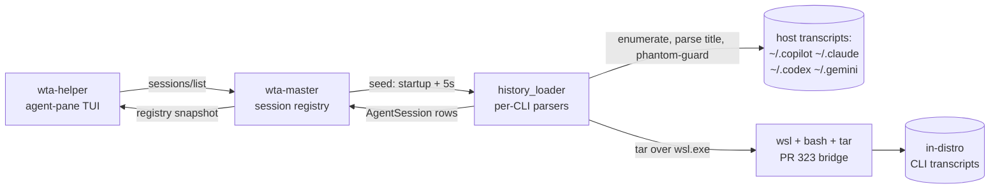
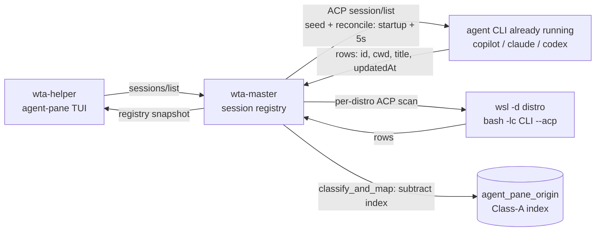

# Session History via ACP `session/list`

## Abstract

Intelligent Terminal sources **all** agent-session history — both host sessions
and in-distro **WSL** sessions — from the running agent's ACP `session/list`,
replacing the on-disk per-CLI `history_loader` subsystem (transcript enumeration,
title parsing, and the resume phantom-guard). The history shown in the session
view is whatever the agent CLI itself enumerates, mapped uniformly for host and
WSL.

It is gated on the agent's `sessionCapabilities.list` capability: agents that
don't implement it (Gemini, non-ACP `custom:` commands) get **empty history with
no on-disk fallback**, by design.

This document records both the **design** and the **feasibility study** that
motivated it. The study began as a narrow WSL question — *"can `session/list`
replace PR #323's tar/file approach for WSL history?"* — and generalized: if the
agent can enumerate its own sessions, there is no reason to parse its on-disk
files for the **host** either. WSL is now one section of a single uniform path,
not a special case.

## Motivation

The previous model read files for everything:

- **Host history**: `history_loader::load_all` enumerated and parsed each CLI's
  on-disk transcripts under the Windows profile — `~/.copilot/session-state`,
  `~/.claude/projects`, `~/.codex/sessions`, `~/.gemini/tmp` — with a separate
  per-CLI parser, title extractor, and resume phantom-guard for each.
- **WSL history (PR #323,
  [`wsl-session-management.md`](./wsl-session-management.md))**: spawned one
  `wsl … bash` per running distro, `tar`-ed the newest CLI transcripts to stdout,
  extracted them host-side, and ran the **same** host parsers over them.

Both were file-reading, both were coupled to each CLI's on-disk format, and WSL
duplicated the whole stack behind a tar bridge. The insight that drove this
change: **the agent CLIs already expose ACP `session/list`, which returns their
own parsed session history.** Asking the agent is one uniform path for host *and*
WSL, with no on-disk-format coupling and no tar branch to maintain.

**Before — disk-based `history_loader`.** The helper asks master; master seeds its
registry by enumerating and parsing each CLI's on-disk transcripts (a per-CLI
parser, title extractor, and phantom-guard), and tars WSL transcripts host-side:



## Design: `session/list` as the sole history source

**After — ACP `session/list`.** The helper still asks master; master now seeds
*and* continuously reconciles its registry from the running agent's own
`session/list` — one round-trip on the existing connection for the host, a
per-distro ACP scan for WSL, and the `agent_pane_origin` index for the Class-A
filter. No disk read:



### Host

1. **Reuse the running agent — no extra spawn.** `wta-master` already spawns the
   agent CLI once at startup and stores its connection + handshake
   (`MasterStateInner::{agent_conn, cached_init_resp}`). Host history calls
   `session/list` on that existing connection (`host_history_via_acp` →
   `host_session_list_raw`), so it costs one round-trip, not a process spawn. A
   2 s TTL cache (`host_list_cache`, holding an `Arc<[SessionInfo]>`) lets the
   reconcile and the title-refresh share that single round-trip.
2. **Capability gate, no disk fallback.** Gated on
   `cached_init_resp.agent_capabilities.session_capabilities.list`. `None`
   (Gemini, non-ACP `custom:` agents) ⇒ **empty history** — there is no on-disk
   fallback.
3. **Class-A filter by session-id (no `_meta`).** `session/list` rows carry only
   `sessionId / cwd / title / updatedAt` — no `_meta` — so an agent-pane (Class A)
   session can't be recognised from the row itself. They are filtered out by
   subtracting the `agent_pane_origin` index (`load_default_set`) from the rows.
   Empirically: of 7 agent-pane-looking host rows, 6 were in the index (the 7th
   predated the index file). To close the race where a just-created pane session
   is listed before its index line is written, master also unions its live
   `session_to_helper` keys (every `session/new` it routed) into the subtracted
   set.
4. **Shared mapper.** `session_history::classify_and_map` maps `acp::SessionInfo`
   → `AgentSession` and applies the Class-A filter, used by host **and** WSL.

The helper-facing `intellterm.wta/sessions/list` handler still answers from
master's registry; what changed is that the registry is now both **seeded** and
continuously **reconciled** against the agent's `session/list` instead of from
disk. The host seed is immediate (`seed_host_and_broadcast`); the slower WSL seed
is spawned asynchronously (`spawn_wsl_seed`) so a distro scan never blocks host
rows. See *Reconcile* below.

### WSL

WSL history is sourced the same way, but the agent runs *inside* the distro, so
it needs a per-distro ACP spawn (proved out by the feasibility study below):

- **Per running distro, per ACP-capable CLI**, `wsl_acp::scan_running_distros_acp`
  spawns `wsl -d <distro> -- bash -lc "<cli> --acp …"`, runs `initialize` +
  `list_sessions`, and maps the rows to `AgentSession` /
  `SessionLocation::Wsl{distro}` through the same shared mapper.
- **Login-shell carrier.** `wsl.exe -- <cmd>` runs a **non-login** `bash -c`,
  which can't find a PATH-installed CLI; the scan uses `bash -lc`.
- **snap cold-start tolerance.** snap copilot's first `--acp` launch pays a
  one-time `Package extraction` (~5–6 s); the WSL `initialize` gets a generous
  timeout so a cold snap isn't misread as failure.
- **Running-distros only**, on the existing 5 s `SessionsChanged` tick — never
  auto-boots a stopped distro.

### Titles come from `session/list`, not disk

Born-bound sessions (`?<prompt>` delegates and agent panes) register **live**
with a *synthetic* title (empty or the cwd basename) before the CLI has written
its generated name. The 5 s rescan re-fetches `session/list` (which carries the
real title), but `upsert_if_absent` drops the row for an already-live session —
so the title is upgraded **in place** instead:

- `host_titles_via_acp` returns **raw, unfiltered** `session/list` rows
  (session-id → title). Raw because Class-A agent-pane rows are excluded from the
  history list yet their *live* registry entries still need a title.
- `refresh_synthetic_titles_from` / `try_refresh_title_via_acp` upgrade only rows
  whose title is still synthetic (`session_registry::title_is_synthetic`).
- Three guards keep this cheap:
  - **synthetic-gate** — only fetch when some row is still synthetic (steady state
    makes no extra ACP calls);
  - **2 s TTL cache** of the raw `session/list` (`host_list_cache`, holding an
    `Arc<[SessionInfo]>` so callers clone a pointer, not the list) — a burst of
    hook/watcher events, the title-refresh, and the reconcile all share one
    `list_sessions` round-trip, instead of the serial, un-debounced watcher loop
    issuing (and stalling up to the 5 s timeout on) one call per event;
  - **cli-source gate** (`row_refreshable_by_connected_agent`) — the connected
    agent enumerates only *its own* CLI's sessions, so a row stamped with a
    *different* known CLI (e.g. a watched `claude` shell session while the agent
    is copilot) is skipped rather than re-queried per event.

This replaces the per-CLI on-disk title parsers (`workspace.yaml` `name:`,
first-user-message JSONL, …): the `session/list` title is the **same** value the
CLI generated, surfaced by the CLI itself.

### `session/list` is authoritative: reconcile, not just seed

`session/list` isn't only the startup seed — it is the ongoing source of truth.
On every 5 s poll the master reconciles its host-history rows against the latest
`session/list` (`sync_host_history`):

- **Add** any newly-listed session not yet in the registry.
- **Drop** any *stale* host row the agent no longer lists. The drop rule
  (`is_stale_host_history_row`, a pure unit-tested predicate) is deliberately
  narrow: only a **Host**, **non-AgentPane**, **terminal** (Ended / Historical)
  row that is **absent from `session/list`** is removed. Live rows, agent-pane
  (Class-A) rows, and anything the agent still lists are always kept.

This is what makes a phantom self-heal: a session the user opened and exited with
no real content never enters the CLI's `session/list` (the agent lists only
sessions with real events — see *Feasibility evidence §2*), so the next poll
drops its leftover row within ~5 s — authoritatively, from the agent's own
enumeration, with **no disk read**. A transient `session/list` failure returns
`None` and is a no-op, so an error never wipes the view. Reconcile runs only for
agents that support `session/list`; for Gemini / non-ACP `custom:` there is
nothing to reconcile against (and no history either).

### What was deleted vs. kept

**Deleted** (the on-disk history subsystem):

- Enumeration loaders: `load_for_cli_async`, `load_host_for_cli`,
  `load_{copilot,claude,gemini,codex}_indexed`, `cli_scan_flags`, the `Candidate`
  discovery, and the loader-only parse helpers — plus PR #323's tar machinery in
  `wsl.rs`.
- Title parsers: `lookup_title_for_session*`, `*_title_for_key`,
  `try_refresh_title_from_disk*`.
- The **picker resume phantom-guard**: `key_is_resumable_on_disk*`. Redundant now
  that picker rows come from the agent's own enumeration of resumable sessions —
  a present row *is* resumable, and the CLI re-validates on `--resume`. WSL rows
  already bypassed this guard, so host rows are now symmetric.
- The **live phantom-prune flow**: `prune_phantom_session_if_ended` /
  `key_has_definite_resumable_content*` and the per-CLI on-disk content scanners
  it drove (`*_session_has_real_content`, `parse_gemini_meta`, the `*_jsonl`
  readers …). It was **helper-local** — it pruned the *helper's* own registry,
  never master's snapshot, which is what the session view actually renders — so
  it never reached a phantom the user saw. Reconcile (above) now drops those rows
  authoritatively from master's registry and `session_watcher` covers live
  Class-B status, so the disk-reading guard is redundant.

**Kept** (different concerns; some still touch disk):

- `agent_pane_origin` index — the Class-A identifier (written by the agent-pane
  lifecycle, read by the filter above).
- `session_watcher` — machine-wide *live* session activity/status, including the
  on-disk reads it needs to resolve a watched session's cwd / pane
  (`copilot_session_dir_for_key`, `find_codex_rollout_by_id`,
  `codex_cwd_from_rollout`, `decode_claude_cwd`, …).

#### Why both on-disk phantom-guards could go

Both disk-reading guards are now redundant, superseded by the agent's own
`session/list` (via reconcile) plus `session_watcher`:

| | Resume phantom-guard | Live phantom-prune |
|---|---|---|
| Function | `key_is_resumable_on_disk*` | `key_has_definite_resumable_content*` / `prune_phantom_session_if_ended` |
| Trigger | user presses Enter to **resume a history row** in the picker | a **live session ends** (`SessionStopped` / pane closed) |
| Question | "is this picker row safe to `--resume`?" | "should I drop this just-ended empty row?" |
| Why redundant | rows now come from `session/list` ⇒ already resumable; the CLI re-validates on `--resume` | reconcile drops the row from master's snapshot once `session/list` stops listing it (a 0-turn session is never listed); the guard only ever pruned the helper-local registry the view doesn't render |

### Accepted trade-offs

- **Gemini / non-ACP `custom:` agents → empty history** (no `session/list`
  capability; no disk fallback).
- **Cross-CLI watched titles stay synthetic.** A session of a *different* CLI than
  the connected agent (e.g. the user runs `claude` in a shell pane while the IT
  agent is copilot) is surfaced *live* by the watcher, but its title can no longer
  be read (it isn't in the copilot agent's `session/list`, and the per-CLI disk
  title read is gone). It shows the cwd-basename placeholder. Niche; accepted as a
  consequence of dropping per-CLI disk reads.

## Feasibility evidence

The empirical study that established `session/list` as a viable sole source. It
was run with a throwaway diagnostic, `wta probe-sessions`
(`src/protocol/acp/probe.rs::probe_sessions`), which spawns an agent in ACP mode,
runs `initialize`, dumps the advertised capabilities, then calls `list_sessions`
and prints the rows — pointed both at Windows-side CLIs directly and at WSL CLIs
through the `wsl.exe` stdio bridge.

### 1. `session/list` support is per-CLI (3 of 4)

| CLI | ACP launch (`agent_registry.rs`) | `sessionCapabilities.list` | `list_sessions` result |
|-----|----------------------------------|----------------------------|------------------------|
| **copilot** | native `--acp --stdio` (`:87`) | `Some` | OK — 50 host sessions |
| **claude** | `npx @agentclientprotocol/claude-agent-acp` (`:109`) | `Some` | OK — 21 host sessions |
| **codex** | `npx @zed-industries/codex-acp` (`:126`) | `Some` | OK — host sessions |
| **gemini** | native `--experimental-acp` (`:144`) | **`None`** | **`Method not found`** |

Versions observed: copilot 1.0.64–1.0.66, claude-agent-acp 0.52.0, codex-acp
0.16.0, gemini-cli 0.46.0. Each supporting CLI returns **structured** rows
(`session_id`, `cwd`, `title`, `updated_at`) parsed by the CLI itself — no
host-side jsonl parsing. **Gemini does not implement the capability**, and its CLI
is dropping ACP upstream, so it is **out of scope** — the reason no file-reading
fallback is kept for it.

The Codex results above were collected with the now-deprecated
`@zed-industries/codex-acp`. The current runtime launch command is
`npx -y @agentclientprotocol/codex-acp@1.1.0`; the original measurements and
reproduction command below are retained as historical evidence.

### 2. `session/list` returns full on-disk history, not just live sessions — and only *real* sessions

Two facts made `session/list` a credible replacement for the disk loaders rather
than just a live-session list:

- **It returns historical, not just live, sessions.** The host copilot probe
  returned 50 rows, the claude probe 21 — far more than were live. The same held
  over the WSL bridge:
  `wta probe-sessions --agent "wsl -d Debian -- bash -lc /home/<user>/acp.sh"`
  (wrapper = `exec copilot --acp --stdio`) returned the Debian distro's historical
  copilot sessions over the normal `wsl.exe` + **pipe stdin** bridge.
- **It returns only sessions with real content.** Debian's
  `~/.copilot/session-state` had 9 UUID dirs but `session/list` returned 2 —
  exactly the 2 with a non-empty `events.jsonl`; the other 7 were empty scaffolds
  (`checkpoints/ files/ research/ workspace.yaml`, no transcript). `session/list`
  is arguably **more** accurate than tar-ing every directory.

### 3. Two WSL traps that masquerade as "ACP doesn't work"

Both produced misleading `"server shut down unexpectedly"` failures until
`wta-probe.log` (which drains the child's stderr) revealed the real cause:

- **`wsl.exe -- <cmd>` runs under a NON-login `bash -c`**, so a PATH-installed CLI
  (`~/.local/node22/bin/copilot`) is `command not found`. **Fix:** `bash -lc`.
  Note `spawn_agent_process` (`spawn.rs`) splits the agent cmdline with
  `split_whitespace` and cannot carry `bash -lc "copilot --acp --stdio"` (the
  quoted script is torn apart) — production threads a no-space wrapper / quote-aware
  parse.
- **`/tmp` is tmpfs and is wiped on distro auto-shutdown**, so a wrapper written
  to `/tmp` vanishes between runs. Use a persistent path (`~/acp.sh`).

### 4. snap-installed copilot DOES work (an earlier "snap is broken" was a measurement error)

Ubuntu's default copilot is a **snap** (`/snap/copilot-cli/50/bin/copilot`). It
prints a **non-fatal** `cannot preserve mount namespace …` warning on stderr, but
`--acp` works: `wta probe-sessions --agent "wsl -d Ubuntu -- bash -lc ~/acp.sh"`
returned `list_sessions: ok` with 4 Ubuntu sessions over normal **pipe stdin**.
An earlier draft concluded snap was broken; that was wrong — the failing runs were
`(printf …; sleep N) | copilot` measured during snap's **cold start** (`Package
extraction took ~5.6 s`) and never cross-checked with `probe`. **Lesson:**
cross-check a WSL CLI with `probe` (pipe stdin, held open) before concluding it
"can't do ACP"; budget for snap cold-start in the initialize timeout.

### 5. "Notify on new session" is orthogonal to ACP

ACP 0.10's Client trait has **no** "session-list-changed" push — only
`session_notification` (updates *within* an existing session) and
`ext_notification`. But the session view does not depend on a push: a 5 s periodic
tick already fans out `AppEvent::SessionsChanged` →
`schedule_agents_refetch_for_open_views`. The host and WSL `session/list` scans
simply participate in that tick; no ACP push exists or is needed.

## Appendix A: how `session/list` was wired before this change

ACP 0.10 defines `list_sessions` as an **UNSTABLE** capability
(`agent-client-protocol-0.10.0/src/agent.rs:150`). WTA enables it
(`Cargo.toml`, feature `unstable_session_list`) but historically used it only on
the **helper ↔ master** hop: `wta-master` answered `session/list` from its **own
live-session registry** and **never forwarded it to the agent CLI**
(`src/master/mod.rs`), so WTA had never observed what an agent CLI's *own*
`session/list` returns — which is exactly what the study above measured. This
change keeps the helper-facing handler answering from the registry, but now
**seeds and reconciles** that registry against the agent's `session/list` (host)
and the per-distro WSL scan, instead of from the on-disk loaders.

## Appendix B: reproduce

```text
# Host, raw per-CLI probe:
wta probe-sessions --agent "copilot --acp --stdio"
wta probe-sessions --agent "npx -y @agentclientprotocol/claude-agent-acp"
wta probe-sessions --agent "npx -y @zed-industries/codex-acp"
wta probe-sessions --agent "gemini --experimental-acp"        # list: None

# WSL, raw single-CLI probe (login shell needed; a no-space wrapper avoids
# spawn_agent_process's split_whitespace):
#   ~/acp.sh is a 2-line script: line 1 "#!/bin/bash", line 2 "exec copilot --acp --stdio"
wta probe-sessions --agent "wsl -d Debian -- bash -lc /home/<user>/acp.sh"

# Production paths (what seeds the session view), mapped + Class-A filtered:
wta probe-host-sessions --agent "copilot --acp --stdio"   # host
wta probe-wsl-sessions                                    # every running distro
wta probe-wsl-sessions --cli copilot                      # one CLI
```

Diagnostic log (drains the child CLI's stderr — decisive for the WSL traps):
`…\IntelligentTerminal\logs\<pkgver>\wta-probe.log`.

## Costs & open questions

- **Per-(distro, CLI) ACP spawn for WSL**; claude/codex add an `npx` download
  inside the distro on first use, and snap copilot pays its one-time extraction.
  Heavier per-call than one tar spawn per distro — but it's a single uniform code
  path (no parallel tar branch). Host costs only one round-trip on the
  already-running connection.
- **Auth.** A logged-out CLI still answers `initialize`/`list_sessions` here, but
  this was not exhaustively tested across CLIs.
- **`session/load` resume into a pane for WSL rows** (vs PR #323's CLI-flag
  resume) is a possible follow-up; copilot/claude/codex advertise
  `loadSession: true`.

## Implementation status

Implemented and verified on the feature branch:

- `wsl_acp.rs` — `scan_running_distros_acp(cli)`: per running distro, per
  ACP-capable CLI, ACP `initialize` + `session/list`, mapped to WSL rows.
- `protocol/acp/session_list.rs` — `fetch_session_list`, the shared
  `initialize` + `session/list` exchange (probe and production).
- `session_history.rs` — `classify_and_map`, the shared `acp::SessionInfo` →
  `AgentSession` mapper + Class-A filter (host and WSL).
- `master/mod.rs` — `seed_host_and_broadcast` (immediate host seed) +
  `spawn_wsl_seed` (async WSL), `host_history_via_acp` → `host_session_list_raw`
  (the `Arc<[SessionInfo]>` 2 s cache), the `sync_host_history` /
  `is_stale_host_history_row` reconcile, `host_titles_via_acp` + the
  synthetic-title refresh (`refresh_synthetic_titles_from`,
  `try_refresh_title_via_acp`, `row_refreshable_by_connected_agent`,
  `host_list_cache`).
- The on-disk loaders, title parsers, the resume phantom-guard, **and the live
  phantom-prune flow** were deleted; `session_watcher` was kept. Phantom cleanup
  is now the `session/list` reconcile (host) + `session_watcher` (live status).
- `wta probe-host-sessions` / `probe-wsl-sessions` exercise the production paths
  end-to-end. Smoke-tested against a running Ubuntu (snap copilot). Full WTA test
  suite: **952 passing**.
